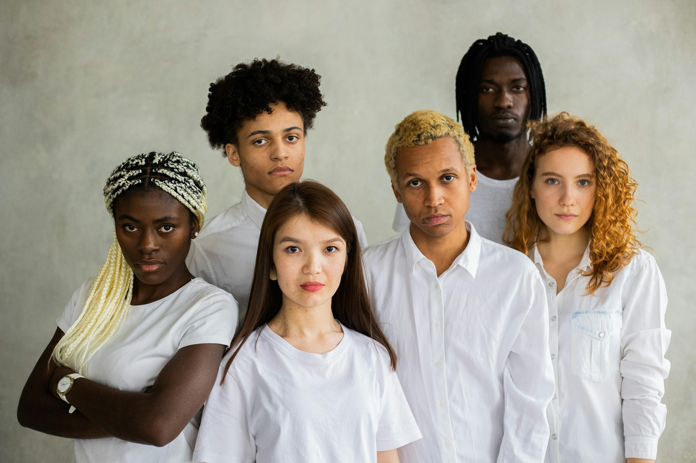
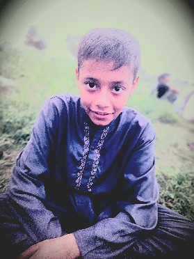
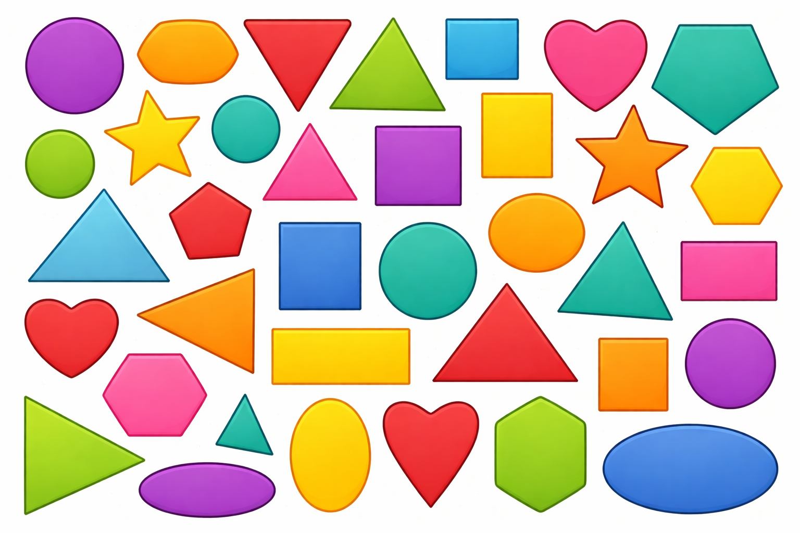

# Python Basics to Advance complete course
# This github helps in learning basics of python and its advance concept
---

## 📌 Table of Contents

* [3D Point Cloud](#3d-point-cloud)
* [Voxel Downsampling](#voxel-downsampling)
* [Outlier Removal](#outlier-removal)
* [KD-Tree](#kd-tree)
* [3D Mesh](#3d-mesh)
* [Mesh Operations](#mesh-operations)
* [Sampling](#sampling)
* [RGBD Handling](#rgbd-handling)
* [Voxelization](#voxelization)
* [Octree](#octree)
* [Surface Reconstruction](#surface-reconstruction)
* [Transformations](#transformations)
* [Mesh Deformation](#mesh-deformation)
* [Intrinsic Shape Signatures](#intrinsic-shape-signatures)
* [Ray Casting](#ray-casting)
* [Registration (ICP)](#registration-icp)
* [Visualization](#visualization)
* [Web Visualizer](#web-visualizer)
* [Open3D for TensorBoard](#open3d-for-tensorboard)
* [Built‑in Datasets](#built-in-datasets)
* [Important Techniques](#important-techniques)

---

# 🟦 Face and eyes Detection On Image.


# Introduction


So today we read about Face detection in an image is a computer vision technique used to locate and identify human faces within a picture. It works by analyzing visual features such as edges, shapes, and patterns that resemble facial structures.

In OpenCV, face detection is commonly performed using Haar Cascade classifiers. This technique is widely used in security systems, cameras, and biometric applications.


# Here we starts some questions


**Q No 1**  What is the ‘Haarcascade file’?


**Ans** The ‘HaarCascade file’ is a classifier file in which it is defined what a face looks like, including its parameters and features. All possible details about the face are available in that file. It is a part of computer vision.


**Q No 2** What is the code of loading an image?


**Ans** Here is the some code to loading an image>


**Code Input**

import cv2


import numpy as np


**Load Image**

 
image = cv2.imread(r"A:\computer_Vision\56.jpg")


**Display Image**

 
cv2.imshow("Original Image", image)


cv2.waitKey(0)


cv2.destroyAllWindows()

	 	
**Qno3** What is the code of converting an image in the gray scale?


**Ans** Here is the full code of converting an image into gray scale>:


**Code Input**


import cv2


import numpy as np


**Load Image**


image = cv2.imread(r"A:\computer_Vision\56.jpg")


**Convert to Gray**


gray = cv2.cvtColor(image, cv2.COLOR_BGR2GRAY)


**Display Images**
cv2.imshow("Original Image", image)
cv2.imshow("Gray Scale Image", gray)
cv2.waitKey(0)
cv2.destroyAllWindows()

	 
**Qno4** Write full code of detecting faces in an image?


**Ans** Here is the full code of detecting faces in an image >


**Input Code**


import cv2
import numpy as np


**Load Image**
image = cv2.imread(r"A:\computer_Vision\56.jpg")
if image is None:
print("Error: Image not found. Check file path.")
    exit()

	
 **Resize Image**
image = cv2.resize(image, (400, 400))


 **Convert to Grayscale**
gray = cv2.cvtColor(image, cv2.COLOR_BGR2GRAY)


 **Load Haar Cascade**
face = cv2.CascadeClassifier(
 cv2.data.haarcascades + "haarcascade_frontalface_default.xml")

 
 **Detect Faces**
faces = face.detectMultiScale(
    gray,
    scaleFactor=1.1,
    minNeighbors=3,
    minSize=(20, 20))

	
 **Copy image for face detection result**
face_img = image.copy()


**Draw Rectangles**
for (x, y, w, h) in faces:
    cv2.rectangle(face_img, (x, y), (x + w, y + h), (255, 0, 0), 2)


**Display Images**
cv2.imshow("Original Image :", image)
cv2.imshow("Gray Image :", gray)
cv2.imshow("Face Detected Image :", face_img)
cv2.waitKey(0)
cv2.destroyAllWindows()

	 
**Qno5** What is the full code of detecting eyes and faces?


**Ans** Here is the full code of detecting faces and eyes>


## Sample code 

```python
import cv2
import numpy as np


			*Load Image*
image_path = r"A:\computer_Vision\56.jpg"
image = cv2.imread(image_path)
if image is None:
    print("Error: Image not found.")
    exit()
			*Resize Image*
image = cv2.resize(image, (500, 500))  # Resize to 500x500


			*Convert to Gray*
gray = cv2.cvtColor(image, cv2.COLOR_BGR2GRAY)


			*Load Haar Cascades*
face_cascade = cv2.CascadeClassifier(cv2.data.haarcascades + "haarcascade_frontalface_default.xml")
eye_cascade = cv2.CascadeClassifier(cv2.data.haarcascades + "haarcascade_eye.xml")


			*Detect Faces and Eyes*
faces = face_cascade.detectMultiScale(
    gray,
    scaleFactor=1.05,  *More sensitive for faces*
    minNeighbors=4,
    minSize=(30, 30)
)


			*through all faces*
for (x, y, w, h) in faces:
    **Draw rectangle around face (Blue) with thin border**
    cv2.rectangle(image, (x, y), (x+w, y+h), (255, 0, 0), 1)    


			*Region of interest for eyes*
    roi_gray = gray[y:y+h, x:x+w]
    roi_color = image[y:y+h, x:x+w]

    
    *Detect Eyes inside this face:*
    eyes = eye_cascade.detectMultiScale(
        roi_gray,
        scaleFactor=1.03,  *Even smaller step for more accuracy*
        minNeighbors=2,     *Lower to detect additional eyes*
        minSize=(8, 8)      *Smaller size to catch tiny eyes)*


    *Loop through all detected eyes*
    for (ex, ey, ew, eh) in eyes:


        *Draw rectangle around eyes (Pink) with thin border.*
        cv2.rectangle(roi_color, (ex, ey), (ex+ew, ey+eh), (255, 0, 255), 1)


			*Display Image*
cv2.imshow("roi:",roi_color)
cv2.imshow("Face and Eyes Detection:", image)
cv2.waitKey(0)
cv2.destroyAllWindows()
```
---




# Drawing Functions in OpenCV

## Introduction
Drawing functions in OpenCV are used to create shapes on images or video frames.  
They help to draw lines, rectangles, circles, ellipses, and text.

These are useful for:
- Highlighting objects  
- Marking regions  
- Visualizing results  

---

## Q1 What are Drawing Functions?
Drawing functions are used to draw shapes and text on images.  
They modify the image directly.

# Sample Of Code.
```python
import cv2
import numpy as np


img = cv2.imread("image.jpg")
img = cv2.resize(img, (500, 500))


cv2.imshow("Result", img)
cv2.waitKey(0)
cv2.destroyAllWindows()


**performing the simple line code**
img = cv2.line(img, (0, 0), (200, 200), (255, 55, 255), 2)


**Drawing the arrowed line**
img = cv2.arrowedLine(img, (0, 350), (255, 255), (255, 50, 200), 2)


**Drawing the rectangle**
img = cv2.rectangle(img, (384, 10), (620, 150), (255, 250, 200), 5)


**Drawing a circle**
img = cv2.circle(img, (270, 145), 100, (230, 130, 240), 2)


**Now putting the text**
font = cv2.FONT_HERSHEY_SCRIPT_SIMPLEX
img = cv2.putText(
    img,
    "SHAMEER...",
    (20, 500),
    font,
    2,
    (130, 255, 110),
    2,
    cv2.LINE_AA
)


**Drawing the ellips**
img = cv2.ellipse(img, (320, 240), (110, 140), 0, 0, 360, (255, 226, 120), 4)


**Creating a full black image**
import numpy as np
img = np.zeros((512, 512, 3), np.uint8)


**Creating a full white image**
img = np.ones((512, 512, 3), np.uint8) * 255


**Last lines of code which are the most importat**
cv2.waitKey(0)
cv2.desttroyeAllWindows.
```



# Removing Background in an Image using OpenCV

## Code

```python
import cv2
import numpy as np


		**Load the main image**
img = cv2.imread(r"A:\computer_Vision\920.jpg")


**Resizing the image**
img = cv2.resize(img, (400, 400))


		**Convert image to HSV**
hsv_original = cv2.cvtColor(img, cv2.COLOR_BGR2HSV)


		**Load ROI image**
roi = cv2.imread(r"A:\computer_Vision\bgr.jpg")
roi = cv2.resize(roi, (100, 100))
hsv_roi = cv2.cvtColor(roi, cv2.COLOR_BGR2HSV)


**Create histogram of ROI**
roi_hist = cv2.calcHist([hsv_roi], [0, 1], None, [180, 256], [0, 180, 0, 256])
cv2.normalize(roi_hist, roi_hist, 0, 255, cv2.NORM_MINMAX)

# Backprojection to create mask
mask = cv2.calcBackProject([hsv_original], [0, 1], roi_hist, [0, 180, 0, 256], 1)

# Filter and remove noise
kernel = cv2.getStructuringElement(cv2.MORPH_ELLIPSE, (5, 5))
mask = cv2.filter2D(mask, -1, kernel)
_, mask = cv2.threshold(mask, 200, 255, cv2.THRESH_BINARY)

# Merge mask with original image
mask_3ch = cv2.merge([mask, mask, mask])
result = cv2.bitwise_and(img, mask_3ch)

# Display results
cv2.imshow("Original Image", img)
cv2.imshow("HSV Original Image", hsv_original)
cv2.imshow("ROI Image", roi)
cv2.imshow("HSV ROI Image", hsv_roi)
cv2.imshow("Mask Image", mask)
cv2.imshow("Result Image", result)

cv2.waitKey(0)
cv2.destroyAllWindows()
```

#uotput result:


# Bitwise Operations in OpenCV

## Introduction
Bitwise operations include AND, OR, NOT, and XOR.  
They are used for tasks like masking and finding regions of interest (ROI).

---

## Code

```python
import cv2
import numpy as np


**Create blank images
img1 = np.zeros((250, 500, 3), np.uint8)
img2 = np.zeros((250, 500, 3), np.uint8)


**Draw rectangles
img1 = cv2.rectangle(img1, (150, 100), (200, 250), (255, 255, 255), -1)
img2 = cv2.rectangle(img2, (10, 10), (170, 190), (255, 255, 255), -1)


**Show images
cv2.imshow("img1", img1)
cv2.imshow("img2", img2)


**AND operation
bitAnd = cv2.bitwise_and(img1, img2)
cv2.imshow("bitAnd", bitAnd)

**OR operation
bitOr = cv2.bitwise_or(img1, img2)
cv2.imshow("bitOr", bitOr)


**NOT operation
bitNot1 = cv2.bitwise_not(img1)
bitNot2 = cv2.bitwise_not(img2)
cv2.imshow("bitNot1", bitNot1)
cv2.imshow("bitNot2", bitNot2)


**XOR operation
bitXor = cv2.bitwise_xor(img1, img2)
cv2.imshow("bitXor", bitXor)


cv2.waitKey(0)
cv2.destroyAllWindows()
```


# Contours and its Functions in OpenCV


**There Are Two Methods**:


## *Introduction*
Contours are used to detect shapes in images.  
Main functions:
- Moments  
- Approximation  
- Convex Hull  
---


***Method No 1***:


*Code Of sample*:

```python:
import cv2
import numpy as np

Load image:
img = cv2.imread("shapes.png")
img = cv2.resize(img, (250, 250))

Convert to grayscale:
gray = cv2.cvtColor(img, cv2.COLOR_BGR2GRAY)

Apply threshold:
ret, thresh = cv2.threshold(gray, 250, 255, cv2.THRESH_BINARY_INV)

Find contours:
cnts, hier = cv2.findContours(thresh, cv2.RETR_TREE, cv2.CHAIN_APPROX_SIMPLE)

print("Number of contours:", len(cnts))

Loop through contours:
for c in cnts:
    M = cv2.moments(c)

    if M["m00"] != 0:
        cX = int(M["m10"] / M["m00"])
        cY = int(M["m01"] / M["m00"])

        	Area:
        area = cv2.contourArea(c)

        	:Approximation
        epsilon = 0.01 * cv2.arcLength(c, True)
        approx = cv2.approxPolyDP(c, epsilon, True)

        	Convex Hull:
        hull = cv2.convexHull(approx)

        	Bounding box:
        x, y, w, h = cv2.boundingRect(hull)
        cv2.rectangle(img, (x, y), (x+w, y+h), (125, 10, 20), 1)

        Draw center:
        cv2.circle(img, (cX, cY), 3, (222, 222, 22), -1)
        cv2.putText(img, "Center", (cX - 20, cY - 10),
                    cv2.FONT_HERSHEY_SIMPLEX, 0.3, (0, 255, 0), 1)

Display:
cv2.imshow("Original Image", img)
cv2.imshow("Gray Image", gray)
cv2.imshow("Threshold Image", thresh)

cv2.waitKey(0)
cv2.destroyAllWindows()
```


###Method No 2:


# Approximation and Convex Hull in OpenCV

***Sample Of Code***

```python
import cv2
import numpy as np

	Load image:
img = cv2.imread("shapes.png")
img = cv2.resize(img, (250, 250))

	Convert to grayscale:
gray = cv2.cvtColor(img, cv2.COLOR_BGR2GRAY)

	Apply threshold:
ret, thresh = cv2.threshold(gray, 250, 255, cv2.THRESH_BINARY_INV)

	Find contours:
cnts, hier = cv2.findContours(thresh, cv2.RETR_TREE, cv2.CHAIN_APPROX_SIMPLE)

print("Number of contours:", len(cnts))

area1 = []

	Loop through contours:
for c in cnts:
    M = cv2.moments(c)

    if M["m00"] != 0:
        cX = int(M["m10"] / M["m00"])
        cY = int(M["m01"] / M["m00"])

        	Area:
        area = cv2.contourArea(c)
        area1.append(area)

        	Approximation:
        epsilon = 0.01 * cv2.arcLength(c, True)
        approx = cv2.approxPolyDP(c, epsilon, True)

        	Convex Hull:
        hull = cv2.convexHull(approx)

        	Bounding rectangle:
        x, y, w, h = cv2.boundingRect(hull)
        cv2.rectangle(img, (x, y), (x+w, y+h), (125, 10, 20), 1)

        	Draw center:
        cv2.circle(img, (cX, cY), 3, (222, 222, 22), -1)
        cv2.putText(img, "Center", (cX - 20, cY - 10),
                    cv2.FONT_HERSHEY_SIMPLEX, 0.3, (0, 255, 0), 1)

	Display images:
cv2.imshow("Original Image", img)
cv2.imshow("Gray Image", gray)
cv2.imshow("Threshold Image", thresh)

cv2.waitKey(0)
cv2.destroyAllWindows()
```

**This is the output**





# Offline Color Picker

```python
import cv2
import numpy as np

def cross(x):
    pass

img = np.zeros((300, 512, 3), np.uint8)
cv2.namedWindow("Color picker")

s1 = "0:OFF 1:ON"
cv2.createTrackbar(s1, "Color picker", 0, 1, cross)

cv2.createTrackbar("R", "Color picker", 0, 255, cross)
cv2.createTrackbar("G", "Color picker", 0, 255, cross)
cv2.createTrackbar("B", "Color picker", 0, 255, cross)

while True:
    cv2.imshow("Color picker", img)

    if cv2.waitKey(1) & 0xFF == 27:
        break

    s = cv2.getTrackbarPos(s1, "Color picker")
    r = cv2.getTrackbarPos("R", "Color picker")
    g = cv2.getTrackbarPos("G", "Color picker")
    b = cv2.getTrackbarPos("B", "Color picker")

    if s == 0:
        img[:] = 0
    else:
        img[:] = [b, g, r]

cv2.destroyAllWindows()
```


# Detecting Objects using Webcam (OpenCV)
## Live Detection

```python
import cv2
import numpy as np

def nothing(x):
    pass

cap = cv2.VideoCapture(0)

cv2.namedWindow("Color Adjustments", cv2.WINDOW_NORMAL)
cv2.resizeWindow("Color Adjustments", 300, 300)

# Trackbars
cv2.createTrackbar("Lower_H", "Color Adjustments", 0, 179, nothing)
cv2.createTrackbar("Lower_S", "Color Adjustments", 48, 255, nothing)
cv2.createTrackbar("Lower_V", "Color Adjustments", 80, 255, nothing)

cv2.createTrackbar("Upper_H", "Color Adjustments", 20, 179, nothing)
cv2.createTrackbar("Upper_S", "Color Adjustments", 255, 255, nothing)
cv2.createTrackbar("Upper_V", "Color Adjustments", 255, 255, nothing)

cv2.createTrackbar("Thresh", "Color Adjustments", 200, 255, nothing)

while True:
    ret, frame = cap.read()
    if not ret:
        break

    frame = cv2.resize(frame, (250, 250))
    hsv = cv2.cvtColor(frame, cv2.COLOR_BGR2HSV)

    l_h = cv2.getTrackbarPos("Lower_H", "Color Adjustments")
    l_s = cv2.getTrackbarPos("Lower_S", "Color Adjustments")
    l_v = cv2.getTrackbarPos("Lower_V", "Color Adjustments")
    u_h = cv2.getTrackbarPos("Upper_H", "Color Adjustments")
    u_s = cv2.getTrackbarPos("Upper_S", "Color Adjustments")
    u_v = cv2.getTrackbarPos("Upper_V", "Color Adjustments")
    thresh_val = cv2.getTrackbarPos("Thresh", "Color Adjustments")

    lower_bound = np.array([l_h, l_s, l_v])
    upper_bound = np.array([u_h, u_s, u_v])

    mask = cv2.inRange(hsv, lower_bound, upper_bound)
    filtr = cv2.bitwise_and(frame, frame, mask=mask)

    mask_inv = cv2.bitwise_not(mask)
    _, thresh = cv2.threshold(mask_inv, thresh_val, 255, cv2.THRESH_BINARY)
    dilate = cv2.dilate(thresh, (3, 3), iterations=2)

    cnts, _ = cv2.findContours(dilate, cv2.RETR_TREE, cv2.CHAIN_APPROX_SIMPLE)
    result = frame.copy()

    for c in cnts:
        if cv2.contourArea(c) > 1000:
            epsilon = 0.0005 * cv2.arcLength(c, True)
            approx = cv2.approxPolyDP(c, epsilon, True)
            hull = cv2.convexHull(approx)

            cv2.drawContours(result, [c], -1, (255, 0, 0), 1)
            cv2.drawContours(result, [hull], -1, (255, 0, 255), 1)

    cv2.imshow("Mask", cv2.resize(mask, (250, 250)))
    cv2.imshow("Filtered", cv2.resize(filtr, (250, 250)))
    cv2.imshow("Threshold", cv2.resize(thresh, (250, 250)))
    cv2.imshow("Result", cv2.resize(result, (250, 250)))

    if cv2.waitKey(1) & 0xFF == 27:
        break

cap.release()
cv2.destroyAllWindows()
```


# Drawing on Video (OpenCV)

```python
import cv2
import datetime

cap = cv2.VideoCapture("video.mp4")

print("Width =", cap.get(3))
print("Height =", cap.get(4))

while cap.isOpened():
    ret, frame = cap.read()

    if ret:
        font = cv2.FONT_HERSHEY_SCRIPT_COMPLEX

        text = "Height: " + str(int(cap.get(4))) + "  Width: " + str(int(cap.get(3)))
        cv2.putText(frame, text, (10, 30), font, 1, (248, 117, 5), 2, cv2.LINE_AA)

        date_data = "Date: " + datetime.datetime.now().strftime("%Y-%m-%d %H:%M:%S")
        cv2.putText(frame, date_data, (10, 70), font, 1, (247, 238, 5), 2, cv2.LINE_AA)

        frame = cv2.resize(frame, (500, 600))
        cv2.imshow("Frame", frame)

        if cv2.waitKey(10) & 0xFF == ord('f'):
            break
    else:
        break

cap.release()
cv2.destroyAllWindows()
```


# Face Detection Using Webcam

## Introduction
Face detection using a webcam is a computer vision technique that identifies and locates human faces in real-time video. It works by capturing frames from the webcam and analyzing them using algorithms such as Haar Cascade. This technology is commonly used in security systems, attendance monitoring, and face recognition applications.

---

## Q1: What is face detection using a webcam?  
**Answer:**  
Face detection using a webcam detects human faces in real-time video captured by a webcam and identifies the location of faces in each frame.

---

## Q2: What does the function `cv2.CAP_DSHOW` do?  
**Answer:**  
`cv2.CAP_DSHOW` opens the webcam using the DirectShow backend on Windows. It helps the camera start faster and prevents warning messages.

---

## Q3: Code of opening a webcam and detecting the face and eyes:

```python
import cv2

# Open Webcam
cap = cv2.VideoCapture(0, cv2.CAP_DSHOW)

while True:
    ret, frame = cap.read()
    frame = cv2.flip(frame, 2)  # Flip horizontally

    # Display frame
    cv2.imshow("Face detect", frame)

    # Press Enter to exiu
    if cv2.waitKey(1) == 13:
        break

# Release camera
cap.release()
cv2.destroyAllWindows()
```


```
# This is the full code of detecting live face + eyes:


**Code input**:


import cv2
import numpy as np

# Load Haar Cascades
face = cv2.CascadeClassifier(cv2.data.haarcascades + "haarcascade_frontalface_default.xml")
eyes = cv2.CascadeClassifier(cv2.data.haarcascades + "haarcascade_eye.xml")

# Open Webcam
cap = cv2.VideoCapture(0, cv2.CAP_DSHOW)

def detector(img):
    gray = cv2.cvtColor(img, cv2.COLOR_BGR2GRAY)
    faces = face.detectMultiScale(gray, 1.3, 5)

    for (x, y, w, h) in faces:
        cv2.rectangle(img, (x, y), (x + w, y + h), (200, 0, 0), 2)
        roi_gray = gray[y:y+h, x:x+w]
        roi_color = img[y:y+h, x:x+w]
        detected_eyes = eyes.detectMultiScale(roi_gray, 1.3, 2)

        for (ex, ey, ew, eh) in detected_eyes:
            cv2.circle(roi_color, (ex + ew//2, ey + eh//2), 20, (255, 105, 180), 2)  # Pink color

    return img

while True:
    ret, frame = cap.read()
    if not ret:
        print("Error: Camera not working")
        break

    frame = cv2.flip(frame, 1)
    cv2.imshow("Face & Eyes Detection", detector(frame))

***Press Enter (13) or 'n' (110) to exit***
    key = cv2.waitKey(1) & 0xFF
    if key == 13 or key == ord('n'):
        break

***Release Camera***
cap.release()
cv2.destroyAllWindows()
```


# Face and Eye Detection on Image

## Introduction
This program detects faces and eyes in a static image using OpenCV and Haar Cascade classifiers. It draws rectangles around detected faces and eyes.

---

## Code

```python
import cv2
import numpy as np

	**Load Image**
image_path = r"A:\computer_Vision\54.jpg"
image = cv2.imread(image_path)
if image is None:
    print("Error: Image not found.")
    exit()

	**Resize Image**
image = cv2.resize(image, (500, 500))  # Resize to 500x500

	**Convert to Gray**
gray = cv2.cvtColor(image, cv2.COLOR_BGR2GRAY)

	**Load Haar Cascades**
face_cascade = cv2.CascadeClassifier(cv2.data.haarcascades + "haarcascade_frontalface_default.xml")
eye_cascade = cv2.CascadeClassifier(cv2.data.haarcascades + "haarcascade_eye.xml")

	**Detect Faces and Eyes**
faces = face_cascade.detectMultiScale(
    gray,
    scaleFactor=1.05,
    minNeighbors=4,
    minSize=(30, 30)
)

	**Loop through all faces**
for (x, y, w, h) in faces:
    cv2.rectangle(image, (x, y), (x+w, y+h), (255, 0, 0), 1)
    
    roi_gray = gray[y:y+h, x:x+w]
    roi_color = image[y:y+h, x:x+w]
    
    	**Detect Eyes inside this face**
    eyes = eye_cascade.detectMultiScale(
        roi_gray,
        scaleFactor=1.03,
        minNeighbors=2,
        minSize=(8, 8)
    )
    
    for (ex, ey, ew, eh) in eyes:
        cv2.rectangle(roi_color, (ex, ey), (ex+ew, ey+eh), (255, 0, 255), 1)

	**Display Image**
cv2.imshow("roi:", roi_color)
cv2.imshow("Face and Eyes Detection:", image)
cv2.waitKey(0)
cv2.destroyAllWindows()
```


# Feature Detection in Images (OpenCV)


***Introduction***
Feature detection is used to identify important points in an image such as corners, edges, and patterns.  
These features help in tasks like object detection, image matching, and tracking.


---


***Corner Detection***
Corner detection finds points in an image where intensity changes sharply.  
It is useful in applications like object recognition and motion tracking.


---


***Harris Corner Detection (Concept)***
OpenCV provides `cv2.cornerHarris()` for detecting corners.


**Parameters:**
- Image (grayscale, float32)
- Block size (neighborhood size)
- Ksize (Sobel derivative size)
- K (free parameter)


---


## Shi-Tomasi Corner Detection


Shi-Tomasi is an improved version of Harris Corner Detection.  
It is more accurate and allows control over number of corners.


---


## Code


```python
import cv2
import numpy as np

*Load Image*
img = cv2.imread("shapes.png")

*Resize Image*
img = cv2.resize(img, (400, 400))

*Convert to Grayscale*
gray = cv2.cvtColor(img, cv2.COLOR_BGR2GRAY)

*Detect Corners*
corners = cv2.goodFeaturesToTrack(gray, 140, 0.01, 5)
corners = np.int64(corners)

*Draw Corners*
for i in corners:
    x, y = i.ravel()
    cv2.circle(img, (x, y), 3, (255, 255, 255), -1)

*Display Result*
cv2.imshow("Result", img)
cv2.waitKey(0)
cv2.destroyAllWindows()
```


# GrabCut Algorithm (Background Removal)

## Introduction
GrabCut is an advanced image segmentation algorithm used to separate the foreground object from the background.  
It works using Gaussian Mixture Models (GMM) and graph cut optimization.

The algorithm starts with a bounding box around the object and then refines the result automatically.

**Applications:**
- Background removal  
- Object extraction  
- Image editing  


## Q1: What is GrabCut Algorithm?


GrabCut is an image segmentation technique used to extract an object from its background.  
It uses color information and graph cuts to improve object boundaries automatically.


# Code Sample:


```python


import cv2
import numpy as np

***Load Image***
img = cv2.imread("car.jpg")
img = cv2.resize(img, (700, 500))

***Create Mask***
mask = np.zeros(img.shape[:2], np.uint8)

***Background and Foreground Models***
bgdModel = np.zeros((1, 65), np.float64)
fgdModel = np.zeros((1, 65), np.float64)

***Define Rectangle (x, y, width, height)***
rect = (60, 60, 580, 380)

***Apply GrabCut***
cv2.grabCut(img, mask, rect, bgdModel, fgdModel, 7, cv2.GC_INIT_WITH_RECT)

***Define Mask***
mask2 = np.where(
    (mask == cv2.GC_FGD) | (mask == cv2.GC_PR_FGD),
    1, 0
).astype('uint8')

***Remove Noise***
kernel = np.ones((3, 3), np.uint8)
mask2 = cv2.morphologyEx(mask2, cv2.MORPH_CLOSE, kernel, iterations=3)
mask2 = cv2.morphologyEx(mask2, cv2.MORPH_OPEN, kernel, iterations=2)

***Apply Mask***
result = img * mask2[:, :, np.newaxis]

***Display Result***
cv2.imshow("Result", result)
cv2.waitKey(0)
cv2.destroyAllWindows()
```


# This is the output result:


# Hand Detection (OpenCV)


## Introduction
Hand detection is a computer vision technique used to detect hands in images or videos.


---


## Q1: What is Hand Detection?
Hand detection is the process of detecting hands from an image or live camera.


---


## Sample Code:


```python


import cv2
import numpy as np
import os
import sys


#Image path
path = "hand.jpg"

#Check file
if not os.path.exists(path):
    print("File not found!")
    sys.exit()

img = cv2.imread(path)

if img is None:
    print("Failed to load image!")
    sys.exit()

# Resize
img = cv2.resize(img, (250, 250))
gray = cv2.cvtColor(img, cv2.COLOR_BGR2GRAY)

# Blur
blur = cv2.medianBlur(gray, 5)

# Threshold
_, thresh = cv2.threshold(blur, 80, 255, cv2.THRESH_BINARY_INV)

# Find contours
cnts, hier = cv2.findContours(thresh, cv2.RETR_EXTERNAL, cv2.CHAIN_APPROX_SIMPLE)
cv2.drawContours(img, cnts, -1, (180, 185, 0), 2)

# Convex Hull
for c in cnts:
    epsilon = 0.0001 * cv2.arcLength(c, True)
    data = cv2.approxPolyDP(c, epsilon, True)
    hull = cv2.convexHull(data)
    cv2.drawContours(img, [c], -1, (50, 50, 100), 2)
    cv2.drawContours(img, [hull], -1, (212, 234, 234), 2)

# Convexity Defects
hull2 = cv2.convexHull(cnts[0], returnPoints=False)
defect = cv2.convexityDefects(cnts[0], hull2)

if defect is not None:
    for i in range(defect.shape[0]):
        s, e, f, d = defect[i, 0]
        start = tuple(cnts[0][s][0])
        end = tuple(cnts[0][e][0])
        far = tuple(cnts[0][f][0])
        cv2.line(img, start, end, (255, 0, 0), 2)
        cv2.circle(img, far, 5, (0, 0, 255), -1)

# Extreme Points
c_max = max(cnts, key=cv2.contourArea)

extLeft  = tuple(c_max[c_max[:, :, 0].argmin()][0])
extRight = tuple(c_max[c_max[:, :, 0].argmax()][0])
extTop   = tuple(c_max[c_max[:, :, 1].argmin()][0])
extBot   = tuple(c_max[c_max[:, :, 1].argmax()][0])

cv2.circle(img, extLeft , 8, (255, 0, 255), -1)
cv2.circle(img, extRight, 8, (0, 125, 255), -1)
cv2.circle(img, extTop  , 8, (255, 10, 0), -1)
cv2.circle(img, extBot  , 8, (19, 152, 152), -1)

# Display
cv2.imshow("Hand Detection", img)
cv2.imshow("Gray", gray)
cv2.imshow("Threshold", thresh)

cv2.waitKey(0)
cv2.destroyAllWindows()
```


# THIS IS THE OUTOUT:


