# Python Basics to Advance complete course
# This github helps in learning basics of python and its advance concept
---

## 📌 Table of Contents

* [3D Point Cloud](#3d-point-cloud)
* [Voxel Downsampling](#voxel-downsampling)
* [Outlier Removal](#outlier-removal)
* [KD-Tree](#kd-tree)
* [3D Mesh](#3d-mesh)
* [Mesh Operations](#mesh-operations)
* [Sampling](#sampling)
* [RGBD Handling](#rgbd-handling)
* [Voxelization](#voxelization)
* [Octree](#octree)
* [Surface Reconstruction](#surface-reconstruction)
* [Transformations](#transformations)
* [Mesh Deformation](#mesh-deformation)
* [Intrinsic Shape Signatures](#intrinsic-shape-signatures)
* [Ray Casting](#ray-casting)
* [Registration (ICP)](#registration-icp)
* [Visualization](#visualization)
* [Web Visualizer](#web-visualizer)
* [Open3D for TensorBoard](#open3d-for-tensorboard)
* [Built‑in Datasets](#built-in-datasets)
* [Important Techniques](#important-techniques)

---

# Code No 1-) Face and eyes Detection On Image.


# Introduction


So today we read about Face detection in an image is a computer vision technique used to locate and identify human faces within a picture. It works by analyzing visual features such as edges, shapes, and patterns that resemble facial structures.

In OpenCV, face detection is commonly performed using Haar Cascade classifiers. This technique is widely used in security systems, cameras, and biometric applications.


# Here we starts some questions


# **Q No 1:**  What is the ‘Haarcascade file’?


**Ans:** The ‘HaarCascade file’ is a classifier file in which it is defined what a face looks like, including its parameters and features. All possible details about the face are available in that file. It is a part of computer vision.


# **Q No 2:** What is the code of loading an image?


**Ans:** Here is the some code to loading an image>


**Code Input**

import cv2


import numpy as np


**Load Image**

 
image = cv2.imread(r"A:\computer_Vision\56.jpg")


**Display Image**

 
cv2.imshow("Original Image", image)


cv2.waitKey(0)


cv2.destroyAllWindows()

	 	
# **Qno3:** What is the code of converting an image in the gray scale?


**Ans:** Here is the full code of converting an image into gray scale>:


# ***THIS CODE IS ONLY FOR LOADING AN IMAGE:


**Code Input**


import cv2


import numpy as np


**Load Image**


image = cv2.imread(r"A:\computer_Vision\56.jpg")


**Convert to Gray**


gray = cv2.cvtColor(image, cv2.COLOR_BGR2GRAY)


**Display Images**
cv2.imshow("Original Image", image)
cv2.imshow("Gray Scale Image", gray)
cv2.waitKey(0)
cv2.destroyAllWindows()

	 
# **Qno4:** Write full code of detecting faces in an image?


**Ans:** Here is the full code of detecting faces in an image >


**Input Code**


```Python Code:


import cv2
import numpy as np


**Load Image**
image = cv2.imread(r"A:\computer_Vision\56.jpg")
if image is None:
print("Error: Image not found. Check file path.")
    exit()

	
 **Resize Image**
image = cv2.resize(image, (400, 400))


 **Convert to Grayscale**
gray = cv2.cvtColor(image, cv2.COLOR_BGR2GRAY)


 **Load Haar Cascade**
face = cv2.CascadeClassifier(
 cv2.data.haarcascades + "haarcascade_frontalface_default.xml")

 
 **Detect Faces**
faces = face.detectMultiScale(
    gray,
    scaleFactor=1.1,
    minNeighbors=3,
    minSize=(20, 20))

	
 **Copy image for face detection result**
face_img = image.copy()


**Draw Rectangles**
for (x, y, w, h) in faces:
    cv2.rectangle(face_img, (x, y), (x + w, y + h), (255, 0, 0), 2)


**Display Images**
cv2.imshow("Original Image :", image)
cv2.imshow("Gray Image :", gray)
cv2.imshow("Face Detected Image :", face_img)
cv2.waitKey(0)
cv2.destroyAllWindows()
```


# THIS IS THE IMAGE WHICH IS USED INTO THE CODE:


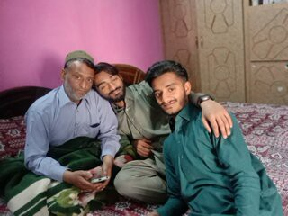


	 
# **Qno5:** What is the full code of detecting eyes and faces?


**Ans:** Here is the full code of detecting faces and eyes>


## Sample code 


```python Code:


import cv2
import numpy as np


			*Load Image*
image_path = r"A:\computer_Vision\56.jpg"
image = cv2.imread(image_path)
if image is None:
    print("Error: Image not found.")
    exit()
			*Resize Image*
image = cv2.resize(image, (500, 500))  # Resize to 500x500


			*Convert to Gray*
gray = cv2.cvtColor(image, cv2.COLOR_BGR2GRAY)


			*Load Haar Cascades*
face_cascade = cv2.CascadeClassifier(cv2.data.haarcascades + "haarcascade_frontalface_default.xml")
eye_cascade = cv2.CascadeClassifier(cv2.data.haarcascades + "haarcascade_eye.xml")


			*Detect Faces and Eyes*
faces = face_cascade.detectMultiScale(
    gray,
    scaleFactor=1.05,  *More sensitive for faces*
    minNeighbors=4,
    minSize=(30, 30)
)


			*through all faces*
for (x, y, w, h) in faces:
    **Draw rectangle around face (Blue) with thin border**
    cv2.rectangle(image, (x, y), (x+w, y+h), (255, 0, 0), 1)    


			*Region of interest for eyes*
    roi_gray = gray[y:y+h, x:x+w]
    roi_color = image[y:y+h, x:x+w]

    
    *Detect Eyes inside this face:*
    eyes = eye_cascade.detectMultiScale(
        roi_gray,
        scaleFactor=1.03,  *Even smaller step for more accuracy*
        minNeighbors=2,     *Lower to detect additional eyes*
        minSize=(8, 8)      *Smaller size to catch tiny eyes)*


    *Loop through all detected eyes*
    for (ex, ey, ew, eh) in eyes:


        *Draw rectangle around eyes (Pink) with thin border.*
        cv2.rectangle(roi_color, (ex, ey), (ex+ew, ey+eh), (255, 0, 255), 1)


			*Display Image*
cv2.imshow("roi:",roi_color)
cv2.imshow("Face and Eyes Detection:", image)
cv2.waitKey(0)
cv2.destroyAllWindows()
```
---


# THE IMAGE WHICH IS USED IN THE CODE:


# Code No 2-) Drawing Functions in OpenCV

## Introduction
Drawing functions in OpenCV are used to create shapes on images or video frames.  
They help to draw lines, rectangles, circles, ellipses, and text.

These are useful for:
- Highlighting objects  
- Marking regions  
- Visualizing results  

---

## Q No 1: What are Drawing Functions?
# Ans **Drawing functions are used to draw shapes and text on images.**  
They modify the image directly.

# Sample Of Code.
```python
import cv2
import numpy as np


img = cv2.imread("image.jpg")
img = cv2.resize(img, (500, 500))


cv2.imshow("Result", img)
cv2.waitKey(0)
cv2.destroyAllWindows()


**performing the simple line code**
img = cv2.line(img, (0, 0), (200, 200), (255, 55, 255), 2)


**Drawing the arrowed line**
img = cv2.arrowedLine(img, (0, 350), (255, 255), (255, 50, 200), 2)


**Drawing the rectangle**
img = cv2.rectangle(img, (384, 10), (620, 150), (255, 250, 200), 5)


**Drawing a circle**
img = cv2.circle(img, (270, 145), 100, (230, 130, 240), 2)


**Now putting the text**
font = cv2.FONT_HERSHEY_SCRIPT_SIMPLEX
img = cv2.putText(
    img,
    "SHAMEER...",
    (20, 500),
    font,
    2,
    (130, 255, 110),
    2,
    cv2.LINE_AA
)


**Drawing the ellips**
img = cv2.ellipse(img, (320, 240), (110, 140), 0, 0, 360, (255, 226, 120), 4)


**Creating a full black image**
import numpy as np
img = np.zeros((512, 512, 3), np.uint8)


**Creating a full white image**
img = np.ones((512, 512, 3), np.uint8) * 255


**Last lines of code which are the most importat**
cv2.waitKey(0)
cv2.desttroyeAllWindows.
```

# THE IMAGE WHICH IS USED IN THE CODE:


# Code No 3-) Removing Background in an Image using OpenCV

## Code

```python
import cv2
import numpy as np


		**Load the main image**
img = cv2.imread(r"A:\computer_Vision\920.jpg")


**Resizing the image**
img = cv2.resize(img, (400, 400))


		**Convert image to HSV**
hsv_original = cv2.cvtColor(img, cv2.COLOR_BGR2HSV)


		**Load ROI image**
roi = cv2.imread(r"A:\computer_Vision\bgr.jpg")
roi = cv2.resize(roi, (100, 100))
hsv_roi = cv2.cvtColor(roi, cv2.COLOR_BGR2HSV)


**Create histogram of ROI**
roi_hist = cv2.calcHist([hsv_roi], [0, 1], None, [180, 256], [0, 180, 0, 256])
cv2.normalize(roi_hist, roi_hist, 0, 255, cv2.NORM_MINMAX)

# Backprojection to create mask
mask = cv2.calcBackProject([hsv_original], [0, 1], roi_hist, [0, 180, 0, 256], 1)

# Filter and remove noise
kernel = cv2.getStructuringElement(cv2.MORPH_ELLIPSE, (5, 5))
mask = cv2.filter2D(mask, -1, kernel)
_, mask = cv2.threshold(mask, 200, 255, cv2.THRESH_BINARY)

# Merge mask with original image
mask_3ch = cv2.merge([mask, mask, mask])
result = cv2.bitwise_and(img, mask_3ch)

# Display results
cv2.imshow("Original Image", img)
cv2.imshow("HSV Original Image", hsv_original)
cv2.imshow("ROI Image", roi)
cv2.imshow("HSV ROI Image", hsv_roi)
cv2.imshow("Mask Image", mask)
cv2.imshow("Result Image", result)

cv2.waitKey(0)
cv2.destroyAllWindows()
```

# THE IMAGE WHICH IS USED IN THE CODE:


# Code No 4-) Bitwise Operations in OpenCV

## Introduction
Bitwise operations include AND, OR, NOT, and XOR.  
They are used for tasks like masking and finding regions of interest (ROI).

---

## Code

```python
import cv2
import numpy as np


**Create blank images
img1 = np.zeros((250, 500, 3), np.uint8)
img2 = np.zeros((250, 500, 3), np.uint8)


**Draw rectangles
img1 = cv2.rectangle(img1, (150, 100), (200, 250), (255, 255, 255), -1)
img2 = cv2.rectangle(img2, (10, 10), (170, 190), (255, 255, 255), -1)


**Show images
cv2.imshow("img1", img1)
cv2.imshow("img2", img2)


**AND operation
bitAnd = cv2.bitwise_and(img1, img2)
cv2.imshow("bitAnd", bitAnd)

**OR operation
bitOr = cv2.bitwise_or(img1, img2)
cv2.imshow("bitOr", bitOr)


**NOT operation
bitNot1 = cv2.bitwise_not(img1)
bitNot2 = cv2.bitwise_not(img2)
cv2.imshow("bitNot1", bitNot1)
cv2.imshow("bitNot2", bitNot2)


**XOR operation
bitXor = cv2.bitwise_xor(img1, img2)
cv2.imshow("bitXor", bitXor)


cv2.waitKey(0)
cv2.destroyAllWindows()
```


# Code No 5-) Contours and its Functions in OpenCV


**There Are Two Methods**:


## *Introduction*
Contours are used to detect shapes in images.  
Main functions:
- Moments  
- Approximation  
- Convex Hull  
---


***Method No 1***:


*Code Of sample*:

```python:
import cv2
import numpy as np

Load image:
img = cv2.imread("shapes.png")
img = cv2.resize(img, (250, 250))

Convert to grayscale:
gray = cv2.cvtColor(img, cv2.COLOR_BGR2GRAY)

Apply threshold:
ret, thresh = cv2.threshold(gray, 250, 255, cv2.THRESH_BINARY_INV)

Find contours:
cnts, hier = cv2.findContours(thresh, cv2.RETR_TREE, cv2.CHAIN_APPROX_SIMPLE)

print("Number of contours:", len(cnts))

Loop through contours:
for c in cnts:
    M = cv2.moments(c)

    if M["m00"] != 0:
        cX = int(M["m10"] / M["m00"])
        cY = int(M["m01"] / M["m00"])

        	Area:
        area = cv2.contourArea(c)

        	:Approximation
        epsilon = 0.01 * cv2.arcLength(c, True)
        approx = cv2.approxPolyDP(c, epsilon, True)

        	Convex Hull:
        hull = cv2.convexHull(approx)

        	Bounding box:
        x, y, w, h = cv2.boundingRect(hull)
        cv2.rectangle(img, (x, y), (x+w, y+h), (125, 10, 20), 1)

        Draw center:
        cv2.circle(img, (cX, cY), 3, (222, 222, 22), -1)
        cv2.putText(img, "Center", (cX - 20, cY - 10),
                    cv2.FONT_HERSHEY_SIMPLEX, 0.3, (0, 255, 0), 1)

Display:
cv2.imshow("Original Image", img)
cv2.imshow("Gray Image", gray)
cv2.imshow("Threshold Image", thresh)

cv2.waitKey(0)
cv2.destroyAllWindows()
```


###Method No 2:


# Code No 5-) Approximation and Convex Hull in OpenCV

***Sample Of Code***

```python
import cv2
import numpy as np

	Load image:
img = cv2.imread("shapes.png")
img = cv2.resize(img, (250, 250))

	Convert to grayscale:
gray = cv2.cvtColor(img, cv2.COLOR_BGR2GRAY)

	Apply threshold:
ret, thresh = cv2.threshold(gray, 250, 255, cv2.THRESH_BINARY_INV)

	Find contours:
cnts, hier = cv2.findContours(thresh, cv2.RETR_TREE, cv2.CHAIN_APPROX_SIMPLE)

print("Number of contours:", len(cnts))

area1 = []

	Loop through contours:
for c in cnts:
    M = cv2.moments(c)

    if M["m00"] != 0:
        cX = int(M["m10"] / M["m00"])
        cY = int(M["m01"] / M["m00"])

        	Area:
        area = cv2.contourArea(c)
        area1.append(area)

        	Approximation:
        epsilon = 0.01 * cv2.arcLength(c, True)
        approx = cv2.approxPolyDP(c, epsilon, True)

        	Convex Hull:
        hull = cv2.convexHull(approx)

        	Bounding rectangle:
        x, y, w, h = cv2.boundingRect(hull)
        cv2.rectangle(img, (x, y), (x+w, y+h), (125, 10, 20), 1)

        	Draw center:
        cv2.circle(img, (cX, cY), 3, (222, 222, 22), -1)
        cv2.putText(img, "Center", (cX - 20, cY - 10),
                    cv2.FONT_HERSHEY_SIMPLEX, 0.3, (0, 255, 0), 1)

	Display images:
cv2.imshow("Original Image", img)
cv2.imshow("Gray Image", gray)
cv2.imshow("Threshold Image", thresh)

cv2.waitKey(0)
cv2.destroyAllWindows()
```


**THE IMAGE WHICH IS USED IN THE CODE:**


# Code No 7-) Offline Color Picker

```python
import cv2
import numpy as np

def cross(x):
    pass

img = np.zeros((300, 512, 3), np.uint8)
cv2.namedWindow("Color picker")

s1 = "0:OFF 1:ON"
cv2.createTrackbar(s1, "Color picker", 0, 1, cross)

cv2.createTrackbar("R", "Color picker", 0, 255, cross)
cv2.createTrackbar("G", "Color picker", 0, 255, cross)
cv2.createTrackbar("B", "Color picker", 0, 255, cross)

while True:
    cv2.imshow("Color picker", img)

    if cv2.waitKey(1) & 0xFF == 27:
        break

    s = cv2.getTrackbarPos(s1, "Color picker")
    r = cv2.getTrackbarPos("R", "Color picker")
    g = cv2.getTrackbarPos("G", "Color picker")
    b = cv2.getTrackbarPos("B", "Color picker")

    if s == 0:
        img[:] = 0
    else:
        img[:] = [b, g, r]

cv2.destroyAllWindows()
```


# Code No8-) Detecting Objects using Webcam (OpenCV)
## Live Detection

```python
import cv2
import numpy as np

def nothing(x):
    pass

cap = cv2.VideoCapture(0)

cv2.namedWindow("Color Adjustments", cv2.WINDOW_NORMAL)
cv2.resizeWindow("Color Adjustments", 300, 300)

# Trackbars
cv2.createTrackbar("Lower_H", "Color Adjustments", 0, 179, nothing)
cv2.createTrackbar("Lower_S", "Color Adjustments", 48, 255, nothing)
cv2.createTrackbar("Lower_V", "Color Adjustments", 80, 255, nothing)

cv2.createTrackbar("Upper_H", "Color Adjustments", 20, 179, nothing)
cv2.createTrackbar("Upper_S", "Color Adjustments", 255, 255, nothing)
cv2.createTrackbar("Upper_V", "Color Adjustments", 255, 255, nothing)

cv2.createTrackbar("Thresh", "Color Adjustments", 200, 255, nothing)

while True:
    ret, frame = cap.read()
    if not ret:
        break

    frame = cv2.resize(frame, (250, 250))
    hsv = cv2.cvtColor(frame, cv2.COLOR_BGR2HSV)

    l_h = cv2.getTrackbarPos("Lower_H", "Color Adjustments")
    l_s = cv2.getTrackbarPos("Lower_S", "Color Adjustments")
    l_v = cv2.getTrackbarPos("Lower_V", "Color Adjustments")
    u_h = cv2.getTrackbarPos("Upper_H", "Color Adjustments")
    u_s = cv2.getTrackbarPos("Upper_S", "Color Adjustments")
    u_v = cv2.getTrackbarPos("Upper_V", "Color Adjustments")
    thresh_val = cv2.getTrackbarPos("Thresh", "Color Adjustments")

    lower_bound = np.array([l_h, l_s, l_v])
    upper_bound = np.array([u_h, u_s, u_v])

    mask = cv2.inRange(hsv, lower_bound, upper_bound)
    filtr = cv2.bitwise_and(frame, frame, mask=mask)

    mask_inv = cv2.bitwise_not(mask)
    _, thresh = cv2.threshold(mask_inv, thresh_val, 255, cv2.THRESH_BINARY)
    dilate = cv2.dilate(thresh, (3, 3), iterations=2)

    cnts, _ = cv2.findContours(dilate, cv2.RETR_TREE, cv2.CHAIN_APPROX_SIMPLE)
    result = frame.copy()

    for c in cnts:
        if cv2.contourArea(c) > 1000:
            epsilon = 0.0005 * cv2.arcLength(c, True)
            approx = cv2.approxPolyDP(c, epsilon, True)
            hull = cv2.convexHull(approx)

            cv2.drawContours(result, [c], -1, (255, 0, 0), 1)
            cv2.drawContours(result, [hull], -1, (255, 0, 255), 1)

    cv2.imshow("Mask", cv2.resize(mask, (250, 250)))
    cv2.imshow("Filtered", cv2.resize(filtr, (250, 250)))
    cv2.imshow("Threshold", cv2.resize(thresh, (250, 250)))
    cv2.imshow("Result", cv2.resize(result, (250, 250)))

    if cv2.waitKey(1) & 0xFF == 27:
        break

cap.release()
cv2.destroyAllWindows()
```


# Code No9-) Drawing on Video (OpenCV)

```python
import cv2
import datetime

cap = cv2.VideoCapture("video.mp4")

print("Width =", cap.get(3))
print("Height =", cap.get(4))

while cap.isOpened():
    ret, frame = cap.read()

    if ret:
        font = cv2.FONT_HERSHEY_SCRIPT_COMPLEX

        text = "Height: " + str(int(cap.get(4))) + "  Width: " + str(int(cap.get(3)))
        cv2.putText(frame, text, (10, 30), font, 1, (248, 117, 5), 2, cv2.LINE_AA)

        date_data = "Date: " + datetime.datetime.now().strftime("%Y-%m-%d %H:%M:%S")
        cv2.putText(frame, date_data, (10, 70), font, 1, (247, 238, 5), 2, cv2.LINE_AA)

        frame = cv2.resize(frame, (500, 600))
        cv2.imshow("Frame", frame)

        if cv2.waitKey(10) & 0xFF == ord('f'):
            break
    else:
        break

cap.release()
cv2.destroyAllWindows()
```


# Code No 10 -) Face Detection Using Webcam:


## Introduction
Face detection using a webcam is a computer vision technique that identifies and locates human faces in real-time video. It works by capturing frames from the webcam and analyzing them using algorithms such as Haar Cascade. This technology is commonly used in security systems, attendance monitoring, and face recognition applications.

---

## Q1: What is face detection using a webcam?  
**Answer:**  
Face detection using a webcam detects human faces in real-time video captured by a webcam and identifies the location of faces in each frame.

---

## Q2: What does the function `cv2.CAP_DSHOW` do?  
**Answer:**  
`cv2.CAP_DSHOW` opens the webcam using the DirectShow backend on Windows. It helps the camera start faster and prevents warning messages.

---

## Q3: Code of opening a webcam and detecting the face and eyes:

```python
import cv2

# Open Webcam
cap = cv2.VideoCapture(0, cv2.CAP_DSHOW)

while True:
    ret, frame = cap.read()
    frame = cv2.flip(frame, 2)  # Flip horizontally

    # Display frame
    cv2.imshow("Face detect", frame)

    # Press Enter to exiu
    if cv2.waitKey(1) == 13:
        break

# Release camera
cap.release()
cv2.destroyAllWindows()
```


```
# This is the full code of detecting live face + eyes:


**Code input**:


import cv2
import numpy as np

# Load Haar Cascades
face = cv2.CascadeClassifier(cv2.data.haarcascades + "haarcascade_frontalface_default.xml")
eyes = cv2.CascadeClassifier(cv2.data.haarcascades + "haarcascade_eye.xml")

# Open Webcam
cap = cv2.VideoCapture(0, cv2.CAP_DSHOW)

def detector(img):
    gray = cv2.cvtColor(img, cv2.COLOR_BGR2GRAY)
    faces = face.detectMultiScale(gray, 1.3, 5)

    for (x, y, w, h) in faces:
        cv2.rectangle(img, (x, y), (x + w, y + h), (200, 0, 0), 2)
        roi_gray = gray[y:y+h, x:x+w]
        roi_color = img[y:y+h, x:x+w]
        detected_eyes = eyes.detectMultiScale(roi_gray, 1.3, 2)

        for (ex, ey, ew, eh) in detected_eyes:
            cv2.circle(roi_color, (ex + ew//2, ey + eh//2), 20, (255, 105, 180), 2)  # Pink color

    return img

while True:
    ret, frame = cap.read()
    if not ret:
        print("Error: Camera not working")
        break

    frame = cv2.flip(frame, 1)
    cv2.imshow("Face & Eyes Detection", detector(frame))

***Press Enter (13) or 'n' (110) to exit***
    key = cv2.waitKey(1) & 0xFF
    if key == 13 or key == ord('n'):
        break

***Release Camera***
cap.release()
cv2.destroyAllWindows()
```


# Code No 11-) Face and Eye Detection on Image

## Introduction
This program detects faces and eyes in a static image using OpenCV and Haar Cascade classifiers. It draws rectangles around detected faces and eyes.

---

## Code

```python
import cv2
import numpy as np

	**Load Image**
image_path = r"A:\computer_Vision\54.jpg"
image = cv2.imread(image_path)
if image is None:
    print("Error: Image not found.")
    exit()

	**Resize Image**
image = cv2.resize(image, (500, 500))  # Resize to 500x500

	**Convert to Gray**
gray = cv2.cvtColor(image, cv2.COLOR_BGR2GRAY)

	**Load Haar Cascades**
face_cascade = cv2.CascadeClassifier(cv2.data.haarcascades + "haarcascade_frontalface_default.xml")
eye_cascade = cv2.CascadeClassifier(cv2.data.haarcascades + "haarcascade_eye.xml")

	**Detect Faces and Eyes**
faces = face_cascade.detectMultiScale(
    gray,
    scaleFactor=1.05,
    minNeighbors=4,
    minSize=(30, 30)
)

	**Loop through all faces**
for (x, y, w, h) in faces:
    cv2.rectangle(image, (x, y), (x+w, y+h), (255, 0, 0), 1)
    
    roi_gray = gray[y:y+h, x:x+w]
    roi_color = image[y:y+h, x:x+w]
    
    	**Detect Eyes inside this face**
    eyes = eye_cascade.detectMultiScale(
        roi_gray,
        scaleFactor=1.03,
        minNeighbors=2,
        minSize=(8, 8)
    )
    
    for (ex, ey, ew, eh) in eyes:
        cv2.rectangle(roi_color, (ex, ey), (ex+ew, ey+eh), (255, 0, 255), 1)

	**Display Image**
cv2.imshow("roi:", roi_color)
cv2.imshow("Face and Eyes Detection:", image)
cv2.waitKey(0)
cv2.destroyAllWindows()
```


# THE IMAGE WHICH IS USED IN THE CODE:


# Code No 12-) Feature Detection in Images (OpenCV)


***Introduction***
Feature detection is used to identify important points in an image such as corners, edges, and patterns.  
These features help in tasks like object detection, image matching, and tracking.


---


***Corner Detection***
Corner detection finds points in an image where intensity changes sharply.  
It is useful in applications like object recognition and motion tracking.


---


***Harris Corner Detection (Concept)***
OpenCV provides `cv2.cornerHarris()` for detecting corners.


**Parameters:**
- Image (grayscale, float32)
- Block size (neighborhood size)
- Ksize (Sobel derivative size)
- K (free parameter)


---


## Shi-Tomasi Corner Detection


Shi-Tomasi is an improved version of Harris Corner Detection.  
It is more accurate and allows control over number of corners.


---


## Code


```python
import cv2
import numpy as np

*Load Image*
img = cv2.imread("shapes.png")

*Resize Image*
img = cv2.resize(img, (400, 400))

*Convert to Grayscale*
gray = cv2.cvtColor(img, cv2.COLOR_BGR2GRAY)

*Detect Corners*
corners = cv2.goodFeaturesToTrack(gray, 140, 0.01, 5)
corners = np.int64(corners)

*Draw Corners*
for i in corners:
    x, y = i.ravel()
    cv2.circle(img, (x, y), 3, (255, 255, 255), -1)

*Display Result*
cv2.imshow("Result", img)
cv2.waitKey(0)
cv2.destroyAllWindows()
```


# THE IMAGE WHICH IS USED IN THE CODE:


# Code No 13-) GrabCut Algorithm (Background Removal)

## Introduction
GrabCut is an advanced image segmentation algorithm used to separate the foreground object from the background.  
It works using Gaussian Mixture Models (GMM) and graph cut optimization.

The algorithm starts with a bounding box around the object and then refines the result automatically.

**Applications:**
- Background removal  
- Object extraction  
- Image editing  


## Q1: What is GrabCut Algorithm?


# Ans **GrabCut is an image segmentation technique used to extract an object from its background.**  
**It uses color information and graph cuts to improve object boundaries automatically.**


# Code Sample:


```python


import cv2
import numpy as np

***Load Image***
img = cv2.imread("car.jpg")
img = cv2.resize(img, (700, 500))

***Create Mask***
mask = np.zeros(img.shape[:2], np.uint8)

***Background and Foreground Models***
bgdModel = np.zeros((1, 65), np.float64)
fgdModel = np.zeros((1, 65), np.float64)

***Define Rectangle (x, y, width, height)***
rect = (60, 60, 580, 380)

***Apply GrabCut***
cv2.grabCut(img, mask, rect, bgdModel, fgdModel, 7, cv2.GC_INIT_WITH_RECT)

***Define Mask***
mask2 = np.where(
    (mask == cv2.GC_FGD) | (mask == cv2.GC_PR_FGD),
    1, 0
).astype('uint8')

***Remove Noise***
kernel = np.ones((3, 3), np.uint8)
mask2 = cv2.morphologyEx(mask2, cv2.MORPH_CLOSE, kernel, iterations=3)
mask2 = cv2.morphologyEx(mask2, cv2.MORPH_OPEN, kernel, iterations=2)

***Apply Mask***
result = img * mask2[:, :, np.newaxis]

***Display Result***
cv2.imshow("Result", result)
cv2.waitKey(0)
cv2.destroyAllWindows()
```


# THE IMAGE WHICH IS USED IN THE CODE:


# Code No 14-) Hand Detection (OpenCV)


## Introduction
Hand detection is a computer vision technique used to detect hands in images or videos.


---


## Q1: What is Hand Detection?
Hand detection is the process of detecting hands from an image or live camera.


---


## Sample Code:


```python


import cv2
import numpy as np
import os
import sys


#Image path
path = "hand.jpg"

#Check file
if not os.path.exists(path):
    print("File not found!")
    sys.exit()

img = cv2.imread(path)

if img is None:
    print("Failed to load image!")
    sys.exit()

# Resize
img = cv2.resize(img, (250, 250))
gray = cv2.cvtColor(img, cv2.COLOR_BGR2GRAY)

# Blur
blur = cv2.medianBlur(gray, 5)

# Threshold
_, thresh = cv2.threshold(blur, 80, 255, cv2.THRESH_BINARY_INV)

# Find contours
cnts, hier = cv2.findContours(thresh, cv2.RETR_EXTERNAL, cv2.CHAIN_APPROX_SIMPLE)
cv2.drawContours(img, cnts, -1, (180, 185, 0), 2)

# Convex Hull
for c in cnts:
    epsilon = 0.0001 * cv2.arcLength(c, True)
    data = cv2.approxPolyDP(c, epsilon, True)
    hull = cv2.convexHull(data)
    cv2.drawContours(img, [c], -1, (50, 50, 100), 2)
    cv2.drawContours(img, [hull], -1, (212, 234, 234), 2)

# Convexity Defects
hull2 = cv2.convexHull(cnts[0], returnPoints=False)
defect = cv2.convexityDefects(cnts[0], hull2)

if defect is not None:
    for i in range(defect.shape[0]):
        s, e, f, d = defect[i, 0]
        start = tuple(cnts[0][s][0])
        end = tuple(cnts[0][e][0])
        far = tuple(cnts[0][f][0])
        cv2.line(img, start, end, (255, 0, 0), 2)
        cv2.circle(img, far, 5, (0, 0, 255), -1)

# Extreme Points
c_max = max(cnts, key=cv2.contourArea)

extLeft  = tuple(c_max[c_max[:, :, 0].argmin()][0])
extRight = tuple(c_max[c_max[:, :, 0].argmax()][0])
extTop   = tuple(c_max[c_max[:, :, 1].argmin()][0])
extBot   = tuple(c_max[c_max[:, :, 1].argmax()][0])

cv2.circle(img, extLeft , 8, (255, 0, 255), -1)
cv2.circle(img, extRight, 8, (0, 125, 255), -1)
cv2.circle(img, extTop  , 8, (255, 10, 0), -1)
cv2.circle(img, extBot  , 8, (19, 152, 152), -1)

# Display
cv2.imshow("Hand Detection", img)
cv2.imshow("Gray", gray)
cv2.imshow("Threshold", thresh)

cv2.waitKey(0)
cv2.destroyAllWindows()
```


# THE IMAGE WHICH IS USED IN THE CODE:


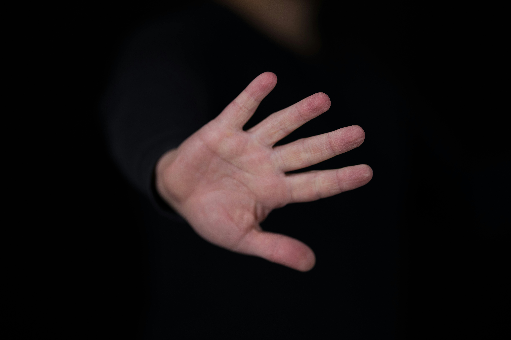


# Code No 15-) Hough Circle Transformation (OpenCV)


***Introduction***


The Hough Circle Transform is an image processing technique used to detect circular shapes in an image.
It works by converting edge points into a parameter space to find circle centers and radii.


This method is very useful when:


Circles are partially hidden
Images contain noise


In OpenCV, it is implemented using:


cv2.HoughCircles()


# **Q1** What is Hough Circle Transformation?

**Ans** The Hough Circle Transform is used to detect circles in an image by identifying their center and radius using edge detection.

***Code to Load an Image***

```python
import cv2
import numpy as np


img = cv2.imread(r"A:\computer_Vision\collor_balls.jpg")
img = cv2.resize(img, (250, 250))
img2 = img.copy()


gray = cv2.cvtColor(img, cv2.COLOR_BGR2GRAY)
gray = cv2.medianBlur(gray, 5)


cv2.imshow("result:", img2)
cv2.imshow("gray:", gray)
cv2.waitKey(0)
cv2.destroyAllWindows()


***Parameters of Hough Circle Detection:***


*(image, method, dp, minDist, param1, param2, minRadius, maxRadius)*


**Q4** What is dp?


**Ans**  dp means Inverse ratio of resolution (Distance per pixel between accumulator and image resolution).


***Code to Draw Detected Circles***
circles = cv2.HoughCircles(gray, cv2.HOUGH_GRADIENT, 1, 20,
                           param1=50, param2=30,
                           minRadius=0, maxRadius=0)


data = np.uint16(np.around(circles))


for (x, y, r) in data[0, :]:
    cv2.circle(img2, (x, y), r, (50, 10, 50), 3)
    cv2.circle(img2, (x, y), 2, (123, 53, 234), -1)
```


***code no 16-) Circle Detection Using Webcam***


```python
import cv2
import numpy as np


cap = cv2.VideoCapture(0)


while True:
    ret, img = cap.read()
    if not ret:
        break

    img2 = img.copy()

    gray = cv2.cvtColor(img, cv2.COLOR_BGR2GRAY)
    gray = cv2.medianBlur(gray, 5)

    circles = cv2.HoughCircles(gray, cv2.HOUGH_GRADIENT, 1, 50,
                               param1=50, param2=30,
                               minRadius=10, maxRadius=0)

    if circles is not None:
        data = np.uint16(np.around(circles))

        for (x, y, r) in data[0, :]:
            cv2.circle(img2, (x, y), r, (50, 10, 50), 3)
            cv2.circle(img2, (x, y), 2, (123, 53, 234), -1)

    cv2.imshow("Detected Circles", img2)

    if cv2.waitKey(25) & 0xFF == ord("n"):
        break

cap.release()
cv2.destroyAllWindows()
```


***Full Code (Two Methods)***


***code No 17-) Detecting Circle By Hough***


```python
import cv2
import numpy as np


**Method 1: Image Detection**
img = cv2.imread(r"A:\computer_Vision\balls.jpg")
img = cv2.resize(img, (250, 250))
img2 = img.copy()


# Converting an image gray:
gray = cv2.cvtColor(img, cv2.COLOR_BGR2GRAY)
gray = cv2.medianBlur(gray, 5)


***Drawing here circles***
circles = cv2.HoughCircles(gray, cv2.HOUGH_GRADIENT, 1, 20,
                           param1=50, param2=30,
                           minRadius=0, maxRadius=0)

if circles is not None:
    data = np.uint16(np.around(circles))
    for (x, y, r) in data[0, :]:
        cv2.circle(img2, (x, y), r, (50, 10, 50), 3)
        cv2.circle(img2, (x, y), 2, (123, 53, 234), -1)

cv2.imshow("result:", img2)
cv2.waitKey(0)
cv2.destroyAllWindows()
```


# THE IMAGE WHICH IS USED IN THE CODE:


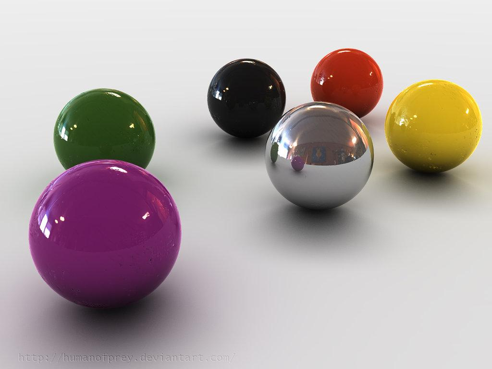


# Method 2: Webcam Detection


```python
import cv2
import numpy as np


cap = cv2.VideoCapture(0)

while True:
    ret, img = cap.read()
    if not ret:
        break

    img2 = img.copy()
    gray = cv2.cvtColor(img, cv2.COLOR_BGR2GRAY)
    gray = cv2.medianBlur(gray, 5)

    circles = cv2.HoughCircles(gray, cv2.HOUGH_GRADIENT, 1, 50,
                               param1=50, param2=30,
                               minRadius=10, maxRadius=0)

    if circles is not None:
        data = np.uint16(np.around(circles))
        for (x, y, r) in data[0, :]:
            cv2.circle(img2, (x, y), r, (50, 10, 50), 3)
            cv2.circle(img2, (x, y), 2, (123, 53, 234), -1)

    cv2.imshow("Detected Circles", img2)

    if cv2.waitKey(25) & 0xFF == ord("n"):
        break

cap.release()
cv2.destroyAllWindows()
```


# Code No 18-) Hough Transformation Lines (OpenCV)
  ***Introduction***

The Hough Transform is used in image processing to detect shapes like lines, circles, and ellipses.


It works by converting image points into a parameter space, where shapes are detected as peaks.
This method works well even when:


Edges are broken.


Images are noisy.


# **Q No 1 What is Hough Transformation?**

**Ans** The Hough Transform detects shapes (like lines or circles) by mapping image points into parameter space and finding peaks.

***Steps of Hough Line Detection***


***Convert image to grayscale***


***Detect edges (Canny)***


***Apply Hough Transform***


***Load Image + Edge Detection***


***Method 1: Hough Lines***


```python


import cv2
import numpy as np


img = cv2.imread(r"A:\computer_Vision\chess_1.png")
img = cv2.resize(img, (250, 250))


gray = cv2.cvtColor(img, cv2.COLOR_BGR2GRAY)
edges = cv2.Canny(gray, 20, 250)


lines = cv2.HoughLines(edges, 1, np.pi/180, 200)

*Here we start the loop:


for line in lines:
    rho, theta = line[0]
    a = np.cos(theta)
    b = np.sin(theta)
    x0 = a * rho
    y0 = b * rho
    x1 = int(x0 + 1000 * (-b))
    y1 = int(y0 + 1000 * (a))
    x2 = int(x0 - 1000 * (-b))
    y2 = int(y0 - 1000 * (a))


    if y1 < 100 and y2 < 100:
        cv2.line(img, (x1, y1), (x2, y2), (255, 0, 255), 2)


cv2.imshow("Edges", edges)
cv2.imshow("Lines", img)
cv2.waitKey(0)
cv2.destroyAllWindows()
```


# THE IMAGE WHICH IS USED IN THE CODE:


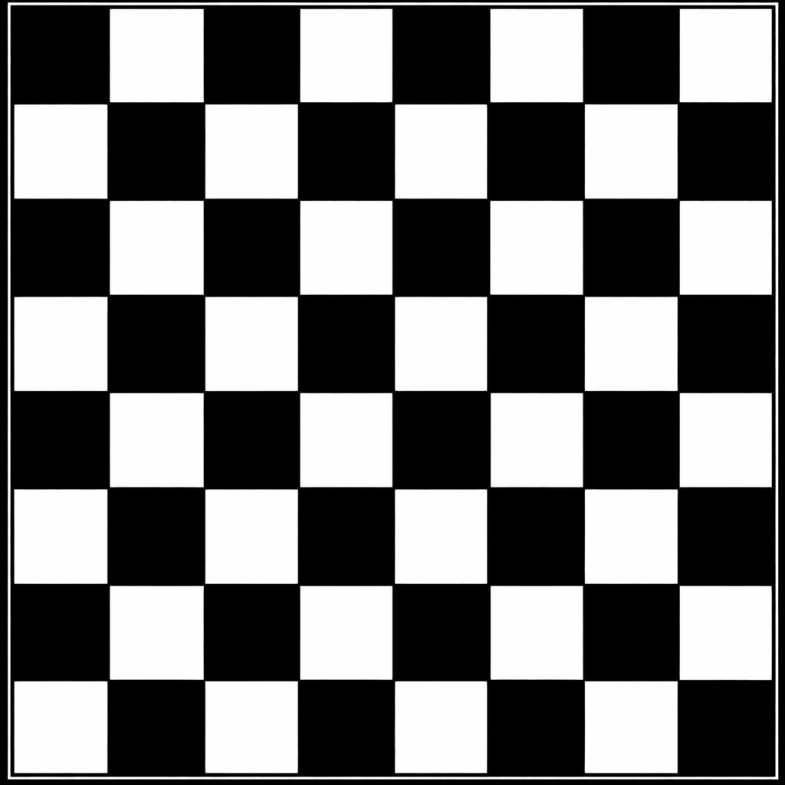


***Method 2: Hough Lines Probabilistic***

```python code:
import cv2
import numpy as np


img = cv2.imread(r"A:\computer_Vision\square.jpg")
img = cv2.resize(img, (250, 250))


gray = cv2.cvtColor(img, cv2.COLOR_BGR2GRAY)
edges = cv2.Canny(gray, 20, 250)


lines = cv2.HoughLinesP(edges, 1, np.pi/180, 100,
                        minLineLength=8, maxLineGap=100)


#Here we start a loop:


for line in lines:
    x1, y1, x2, y2 = line[0]
    cv2.line(img, (x1, y1), (x2, y2), (100, 200, 125), 2)


cv2.imshow("Edges", edges)
cv2.imshow("Lines", img)
cv2.waitKey(0)
cv2.destroyAllWindows()


#Functions Used


cv2.HoughLines() → Detect infinite lines
cv2.HoughLinesP() → Detect line segments
```


# THE IMAGE WHICH IS USED IN THE CODE:


# Code No 19-) Image Background Removal (OpenCV)


  ***Introduction***


Image background removal is a technique used to separate the main object from its background.


It helps to:


Improve image clarity
Remove unwanted areas
Make images more professional

 
# **Q No 1** What is Image Background Removal?


**Ans**  It is the process of removing the background of an image while keeping only the important object.

***Steps Used into the code***


# No 1: ***Load image***


# No 2:***Convert to HSV color space***


# No 3:***Select ROI (Region of Interest)***


# No 4:***Create histogram***


# No 5:***Apply back projection***


# No 6:***Remove noise***


# No 7: ***Merge mask with image***


***Sample of code***

```pyhon


import cv2
import numpy as np

# Load original image
original_image = cv2.imread(r"A:\computer_Vision\534.jpg")
original_image = cv2.resize(original_image, (250, 250))

# Convert to HSV
hsv_original = cv2.cvtColor(original_image, cv2.COLOR_BGR2HSV)

# ROI (reference image)
roi = cv2.imread(r"A:\computer_Vision\copy.jpg")
hsv_roi = cv2.cvtColor(roi, cv2.COLOR_BGR2HSV)

# Histogram of ROI
roi_hist = cv2.calcHist([hsv_roi], [0,1], None,
                        [180, 256], [0, 180, 0, 256], 1)

# Back projection
mask = cv2.calcBackProject([hsv_original],
                           [0, 1], roi_hist,
                           [0, 180, 0, 256], 1)

# Noise removal
kernel = cv2.getStructuringElement(cv2.MORPH_ELLIPSE, (5, 5))
mask = cv2.filter2D(mask, -1, kernel)
_, mask = cv2.threshold(mask, 200, 255, cv2.THRESH_BINARY)

# Merge mask
mask = cv2.merge((mask, mask, mask))
result = cv2.bitwise_or(original_image, mask)

# Display
cv2.imshow("Original", original_image)
cv2.imshow("Mask", mask)
cv2.imshow("Result", result)

cv2.waitKey(0)
cv2.destroyAllWindows()
```


# THE IMAGE WHICH IS USED IN THE CODE:

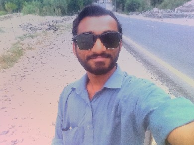


# Code No 20-) Image Blending with OpenCV:
   
   
   ***Introduction***


Image blending is a technique used to combine two images into one.


In OpenCV, blending is done using:


cv2.addWeighted()


It mixes two images using weights.


 # **Q No 1** What is Image Blending?


**Ans** Image blending combines two images by assigning weights to each image.


***Example***:


**50% Image1**


**50% Image2**


***Formula***


result = cv2.addWeighted(img1, alpha, img2, beta, gamma)
alpha → weight of first image
beta → weight of second image
gamma → brightness value


***The code as you want***

```python code:


import cv2
import numpy as np


# Read images:


img1 = cv2.imread(r"A:\computer_Vision\pic_1.jpg")
img2 = cv2.imread(r"A:\computer_Vision\pic_2.jpg")


***Check images***


if img1 is None or img2 is None:
    print("Error: Images not found")
    exit()


# Resize images:


img1 = cv2.resize(img1, (500, 500))
img2 = cv2.resize(img2, (500, 500))

# Blend images:


result = cv2.addWeighted(img1, 0.5, img2, 0.5, 1)

# Show images:


cv2.imshow("Image 1", img1)
cv2.imshow("Image 2", img2)
cv2.imshow("Blended Result", result)

cv2.waitKey(0)
cv2.destroyAllWindows()
```

# THE IMAGE WHICH IS USED IN THE CODE:


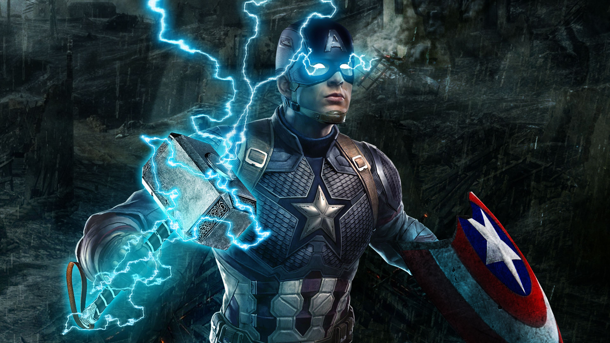


#  THE IMAGE WHICH IS USED IN THE CODE:


# Code No 21-) Creating Image Border (OpenCV):
   ***Introduction***


Image border is used to add padding around an image.


In OpenCV, this is done using:


cv2.copyMakeBorder()
# **Q No1**: What is Image Border?


**Ans** It is the process of adding space (border) around an image.


***Function Syntax***


cv2.copyMakeBorder(img, top, bottom, left, right, borderType, value)
top, bottom, left, right → border size
borderType → type of border
value → color (for constant border)


# THE FULL CODE OF CREATING THE BORDERS:


```python code:


import cv2
import numpy as np

# Load image:
img = cv2.imread(r"A:\computer_Vision\lion.jpg")
img = cv2.resize(img, (500, 500))

# Create border:
border = cv2.copyMakeBorder(img, 20, 20, 5, 5,
                            cv2.BORDER_CONSTANT,
                            value=[160, 27, 141])

# Show result:
cv2.imshow("Border Image", border)
cv2.waitKey(0)
cv2.destroyAllWindows()
```


# THE IMAGE WHICH IS USED IN THE CODE:


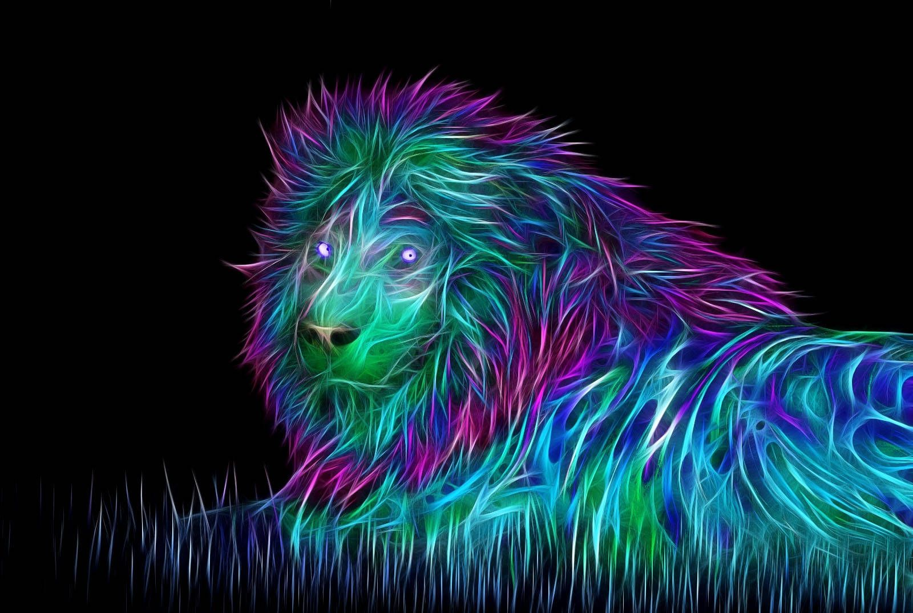


# Code No 22-) Image Analysis Using Histogram (OpenCV):


   ***Introduction***

   

A histogram shows the distribution of pixel intensity values in an image.


It helps to:


***Understand brightness and contrast.***


***Analyze image quality.***


***Improve images using enhancement techniques.***


# **Q No 1** What is Histogram?


**Ans** A histogram is a graph that represents how pixel values are distributed in an image.


**calcHist() Syntax**


cv2.calcHist([img], [channel], mask, [histSize], [0, 256])


***Method 1: Simple Histogram:***

```python code:


import cv2
import numpy as np
from matplotlib import pyplot as plt


img = np.zeros((200, 200), np.uint8)


hist = cv2.calcHist([img], [0], None, [256], [0, 256])
plt.plot(hist)
plt.title("Simple Histogram")
plt.show()
```


***Method 2: Drawing Shapes + Histogram:***


```python code:


import cv2
import numpy as np
from matplotlib import pyplot as plt

img = np.zeros((200, 200), np.uint8)

cv2.rectangle(img, (0,100), (200,200), (100), -1)
cv2.rectangle(img, (0,50), (50,100), (127), -1)

hist = cv2.calcHist([img], [0], None, [256], [0, 256])
plt.plot(hist)
plt.title("Histogram with Shapes")
plt.show()
```

# HERE IN THE CODE WE HAVE NOT USING AN ANY IMAGE


# because the code has been made like this.


***Method 3: Color Histogram:***


```python code:


import cv2
from matplotlib import pyplot as plt

img = cv2.imread(r"A:\computer_Vision\624.jpg")
img = cv2.resize(img, (250, 250))

b, g, r = cv2.split(img)

plt.hist(b.ravel(), 256, [0,256])
plt.hist(g.ravel(), 256, [0,256])
plt.hist(r.ravel(), 256, [0,256])

plt.title("Color Histogram")
plt.show()
```


# THE IMAGE WHICH IS USED IN THE CODE:


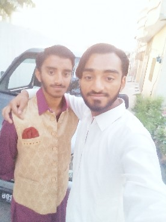


***Method 4: Grayscale + Equalization:***


```python code:


import cv2
import numpy as np
from matplotlib import pyplot as plt

img = cv2.imread(r"A:\computer_Vision\624.jpg")
img = cv2.resize(img, (250, 250))

gray = cv2.cvtColor(img, cv2.COLOR_BGR2GRAY)

# Histogram
hist = cv2.calcHist([gray], [0], None, [256], [0, 256])
plt.plot(hist)
plt.title("Gray Histogram")
plt.show()

# Equalization
equ = cv2.equalizeHist(gray)
res = np.hstack((gray, equ))

cv2.imshow("Original vs Equalized", res)

hist2 = cv2.calcHist([equ], [0], None, [256], [0, 256])
plt.plot(hist2)
plt.title("Equalized Histogram")
plt.show()

cv2.waitKey(0)
cv2.destroyAllWindows()
```


# THE IMAGE WHICH IS USED IN THE CODE:


***Method 5: CLAHE (Advanced):***


```python code:


import cv2
from matplotlib import pyplot as plt

img = cv2.imread(r"A:\computer_Vision\54.jpg")
img = cv2.resize(img, (250, 250))

gray = cv2.cvtColor(img, cv2.COLOR_BGR2GRAY)

clahe = cv2.createCLAHE(clipLimit=2.0, tileGridSize=(8, 8))
cl1 = clahe.apply(gray)

cv2.imshow("CLAHE", cl1)

hist = cv2.calcHist([cl1], [0], None, [256], [0, 256])
plt.plot(hist)
plt.title("CLAHE Histogram")
plt.show()

cv2.waitKey(0)
cv2.destroyAllWindows()
```


# THE IMAGE WHICH IS USED IN THE CODE:


# **Q No 1** What is CLAHE?

**Ans** CLAHE (Contrast Limited Adaptive Histogram Equalization):

*No 1: Divides image into small regions*
*No 2: Enhances contrast locally*
*No 3: Reduces noise*


# Code No 23-) Morphological Transformations (OpenCV):


   ***Introduction***


Morphological Transformations are image processing operations based on image shape.


They are mainly applied on binary images and require:


***Input image:***


# Structuring element (kernel)


***Types of Operations***


No1- ***Erosion → Removes small white noise.***


No2- ***Dilation → Expands white regions.***


No3- ***Opening → Erosion + Dilation.***


No4- ***Closing → Dilation + Erosion.***


No5- ***Top Hat → Highlights bright regions.***


No6- ***Black Hat → Highlights dark regions.***


No7- ***Gradient → Difference between dilation and erosion.***


# Method 1: Basic Opening & Closing:


```python code:


import cv2
import numpy as np

img = cv2.imread(r"A:\computer_Vision\collor_balls.jpg", cv2.IMREAD_GRAYSCALE)
img = cv2.resize(img, (200, 200))

_, mask = cv2.threshold(img, 230, 255, cv2.THRESH_BINARY_INV)

kernel = np.ones((3, 3), np.uint8)

# Opening
opening = cv2.morphologyEx(mask, cv2.MORPH_OPEN, kernel)

# Closing
closing = cv2.morphologyEx(mask, cv2.MORPH_CLOSE, kernel)

cv2.imshow("Image", img)
cv2.imshow("Mask", mask)
cv2.imshow("Opening", opening)
cv2.imshow("Closing", closing)

cv2.waitKey(0)
cv2.destroyAllWindows()
```


# THE IMAGE WHICH IS USED IN THE CODE:


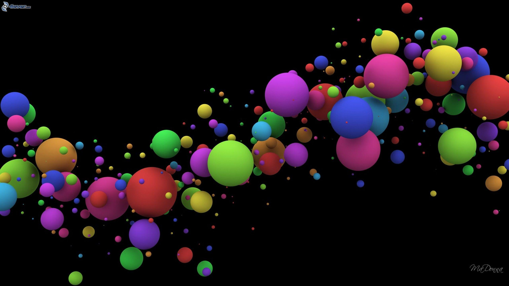


Method 2: All Morphological Operations


```python code:


import cv2
import numpy as np
from matplotlib import pyplot as plt

# Load image
img = cv2.imread(r"A:\computer_Vision\girl.jpg")
img = cv2.resize(img, (300, 300))

# Convert to grayscale
gray = cv2.cvtColor(img, cv2.COLOR_BGR2GRAY)

# Threshold
_, mask = cv2.threshold(gray, 150, 255, cv2.THRESH_BINARY_INV)

kernel = np.ones((2, 2), np.uint8)

# Operations
erosion = cv2.erode(mask, kernel, iterations=1)
dilation = cv2.dilate(mask, kernel, iterations=1)
opening = cv2.morphologyEx(mask, cv2.MORPH_OPEN, kernel)
closing = cv2.morphologyEx(mask, cv2.MORPH_CLOSE, kernel)
tophat = cv2.morphologyEx(mask, cv2.MORPH_TOPHAT, kernel)
gradient = cv2.morphologyEx(mask, cv2.MORPH_GRADIENT, kernel)
blackhat = cv2.morphologyEx(mask, cv2.MORPH_BLACKHAT, kernel)

# Show with OpenCV
cv2.imshow("Original", img)
cv2.imshow("Mask", mask)
cv2.imshow("Erosion", erosion)
cv2.imshow("Dilation", dilation)
cv2.imshow("Opening", opening)
cv2.imshow("Closing", closing)
cv2.imshow("TopHat", tophat)
cv2.imshow("Gradient", gradient)
cv2.imshow("BlackHat", blackhat)

# Show with Matplotlib
titles = ['Original', 'Mask', 'Erosion', 'Dilation', 'Opening', 'Closing', 'TopHat', 'Gradient', 'BlackHat']
images = [img, mask, erosion, dilation, opening, closing, tophat, gradient, blackhat]

plt.figure(figsize=(10, 10))
for i in range(9):
    plt.subplot(3, 3, i+1)
    plt.title(titles[i])
    plt.xticks([])
    plt.yticks([])
    if len(images[i].shape) == 3:
        plt.imshow(cv2.cvtColor(images[i], cv2.COLOR_BGR2RGB))
    else:
        plt.imshow(images[i], cmap='gray')

plt.tight_layout()
plt.show()

cv2.waitKey(0)
cv2.destroyAllWindows()
```

# THE IMAGE WHICH IS USED IN THE CODE:


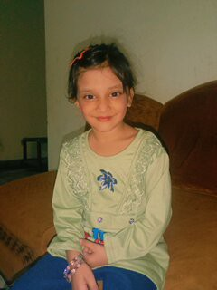


# Code No 25-) Mouse Binding (OpenCV):
   ***Introduction***

***Mouse Binding allows you to detect mouse clicks on an image.***


***Left Click → Show coordinates***


***Right Click → Show pixel color***


```python Code:


import cv2
import numpy as np

def mouse_event(event, x, y, flags, param):

    font = cv2.FONT_HERSHEY_PLAIN

    # Left click → coordinates
    if event == cv2.EVENT_LBUTTONDOWN:
        cord = str(x) + " , " + str(y)
        cv2.putText(img, cord, (x, y), font, 1, (155, 125, 100), 2)

    # Right click → BGR color
    if event == cv2.EVENT_RBUTTONDOWN:
        b = img[y, x, 0]
        g = img[y, x, 1]
        r = img[y, x, 2]
        color = str(b) + " , " + str(g) + " , " + str(r)
        cv2.putText(img, color, (x, y), font, 1, (152, 255, 130), 2)

cv2.namedWindow("res")

img = cv2.imread(r"A:\computer_Vision\54.jpg")
img = cv2.resize(img, (500, 500))

cv2.setMouseCallback("res", mouse_event)

while True:
    cv2.imshow("res", img)
    if cv2.waitKey(1) & 0xFF == 110:   # press 'n' to exit
        break

cv2.destroyAllWindows()
```


# Code No 26-) Image Contours (OpenCV):


   ***Introduction***
   

**Contours are curves that join continuous points with same intensity.**


# They are useful for:


***Shape analysis***


***Object detection***


# **Q No 1** What are Contours?


**Ans** Contours represent the boundary of objects in an image.


# Best results:


***Use grayscale image**


***Apply threshold (binary image):***


# Functions Used:


***cv2.findContours()***


***cv2.drawContours()***


```Python Code:
import cv2
import numpy as np

# Load image
img = cv2.imread(r"A:\computer_Vision\wow_pic.jpg")
img = cv2.resize(img, (350, 350))

# Convert to grayscale
gray = cv2.cvtColor(img, cv2.COLOR_BGR2GRAY)

# Apply threshold
ret, thresh = cv2.threshold(gray, 127, 255, cv2.THRESH_BINARY)

# Find contours
cnts, hier = cv2.findContours(thresh, cv2.RETR_TREE, cv2.CHAIN_APPROX_SIMPLE)

# Draw all contours (-1 means all)
cv2.drawContours(img, cnts, -1, (20, 250, 15), 4)

# Show results
cv2.imshow("Original", img)
cv2.imshow("Gray", gray)
cv2.imshow("Threshold", thresh)

cv2.waitKey(0)
cv2.destroyAllWindows()
```


# Parameters
**cv2.drawContours(image, contours, index, color, thickness)**


**index = -1 → draw all contours**


**color → contour color**


**thickness → line thickness**


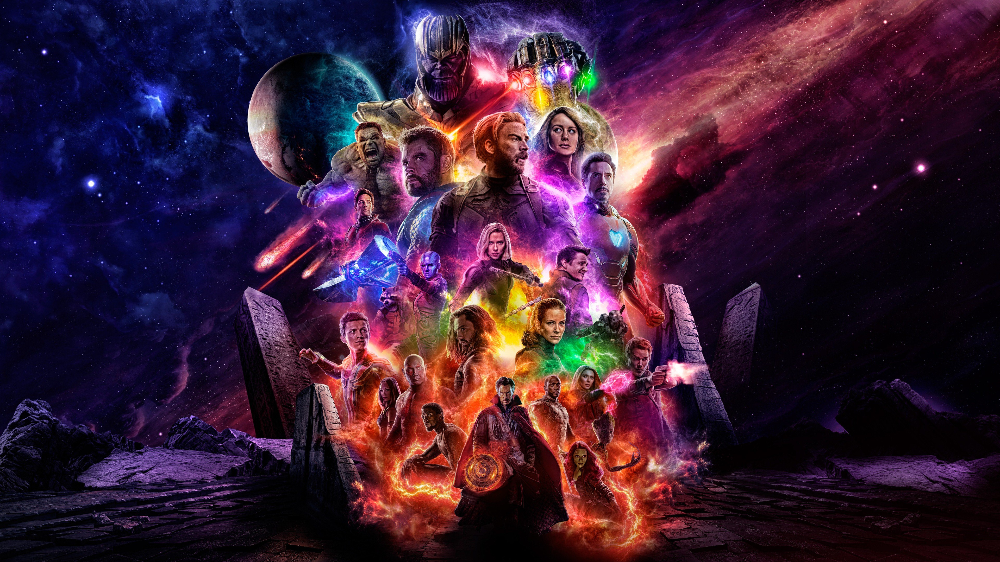


# Code No 27-) Image Gradient (OpenCV):


   ***Introduction:***
   

***Image Gradient shows the change in intensity or color in an image.***


# It is mainly used for:


# No 1)- ***Edge detection***


# No 2)- ***Feature extraction***


# **Q No 1:** What is Image Gradient?

**Ans:** It represents how pixel values change in an image.


# Methods Used:


# Meth No 1-) ***Laplacian → detects edges using second derivative***


# Meth No 2-) ***Sobel X → detects vertical edges.***


# Meth No 3-) ***Sobel Y → detects horizontal edges.***


```Python Code:


import cv2
import numpy as np


# Load image
img = cv2.imread(r"A:\computer_Vision\ben-10.jpg")
img = cv2.resize(img, (250, 250))


# Convert to grayscale
gray = cv2.cvtColor(img, cv2.COLOR_BGR2GRAY)


# Laplacian
lap = cv2.Laplacian(gray, cv2.CV_64F, ksize=3)
lap = np.uint8(np.absolute(lap))


# Sobel X and Y
sobelx = cv2.Sobel(gray, cv2.CV_64F, 1, 0, ksize=3)
sobely = cv2.Sobel(gray, cv2.CV_64F, 0, 1, ksize=3)


sobelx = np.uint8(np.absolute(sobelx))
sobely = np.uint8(np.absolute(sobely))


# Combine Sobel
sobelcombine = cv2.bitwise_or(sobelx, sobely)


# Show results
cv2.imshow("Original", img)
cv2.imshow("Gray", gray)
cv2.imshow("Laplacian", lap)
cv2.imshow("Sobel X", sobelx)
cv2.imshow("Sobel Y", sobely)
cv2.imshow("Sobel Combine", sobelcombine)


cv2.waitKey(0)
cv2.destroyAllWindows()
```


# THIS IS THE IMAGE WHICH IS USED:


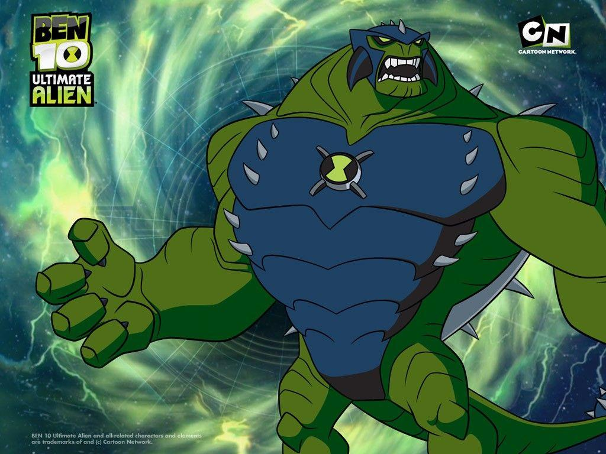


# Code No 28-) Image Operations (Pixels & Coordinates) - OpenCV


***Introduction***

# This project shows how to:

# No 1-): ***Access pixel values.***


# No 2-) ***Get image properties.***


# No 3-) ***Split and merge color channels.***


# Image Properties:


**You can get:**

# 1-) **Shape (height, width, channels)**
# 2-) **Total pixels.**
# 3-) **Data type.**


# Method 1: Split & Merge Channels-)


```Pythin Code:


import cv2
import numpy as np

# Load image
img = cv2.imread(r"A:\computer_Vision\54.jpg")
img = cv2.resize(img, (300, 300))

# Image properties
print("shape==", img.shape)
print("no.of pixels==", img.size)
print("datatype==", img.dtype)

# Split channels (BGR)
b, g, r = cv2.split(img)

# Merge channels (RGB order)
merged = cv2.merge((r, g, b))

# Show images
cv2.imshow("Original", img)
cv2.imshow("Merged (RGB)", merged)

cv2.waitKey(0)
cv2.destroyAllWindows()
```


# THIS IS THE IMAGE WHICH IS USED IN THE CODE:


# Method 2: Pixel Access-)


```Python Code:


import cv2

# Load image
img = cv2.imread(r"A:\computer_Vision\lion.jpg")
img = cv2.resize(img, (600, 600))

# Image properties
print("shape==", img.shape)
print("no.of pixels==", img.size)
print("datatype==", img.dtype)

# Access pixel
px = img[520, 580]
print("Pixel value:", px)

# Access BGR channels
blue = img[520, 580, 0]
green = img[520, 580, 1]
red = img[520, 580, 2]

print("Blue:", blue)
print("Green:", green)
print("Red:", red)

cv2.imshow("Image", img)
cv2.waitKey(0)
cv2.destroyAllWindows()
```


# THIS IS THE IAMGE WHICH IS USED IN THE CODE:


#Code No 29-) Image Smoothing and Filters - OpenCV:


   ***Introduction:***
   

**Image smoothing (blurring) is a common operation in image processing.**


***Used to remove noise from images.***


***Different filters achieve smoothing in various ways:***


***Low-pass filters (LPF): Remove noise.***


***High-pass filters (HPF): Detect edges.***


**Common smoothing filters include:**


# ***Filter Summary:***


# No 1-) ***Homogeneous / Averaging***


# No 2-) ***Gaussian***


# No 3-) ***Median***


# No 4-) ***Bilateral***


```Python Code:


import cv2
import numpy as np
from matplotlib import pyplot as plt

# Load image
img = cv2.imread(r"A:\computer_Vision\534.jpg")
img = cv2.resize(img, (250, 250))
cv2.imshow("Original", img)

# 1️⃣ Homogeneous filter:
kernel = np.ones((5, 5), np.float32) / 25
h_filter = cv2.filter2D(img, -1, kernel)
cv2.imshow("Homogeneous", h_filter)

# 2️⃣ Blur / Averaging:
blur = cv2.blur(img, (8, 8))
cv2.imshow("Blur", blur)

# 3️⃣ Gaussian filter:
gau = cv2.GaussianBlur(img, (5, 5), 0)
cv2.imshow("Gaussian", gau)

# 4️⃣ Median filter:
med = cv2.medianBlur(img, 5)
cv2.imshow("Median", med)

# 5️⃣ Bilateral filter:
bi_f = cv2.bilateralFilter(img, 9, 75, 75)
cv2.imshow("Bilateral", bi_f)

# Plot all images
titles = ["Original", "Homogeneous", "Blur", "Gaussian", "Median", "Bilateral"]
images = [img, h_filter, blur, gau, med, bi_f]

plt.figure(figsize=(10,6))
for i in range(6):
    plt.subplot(2, 3, i + 1)
    plt.imshow(cv2.cvtColor(images[i], cv2.COLOR_BGR2RGB))
    plt.title(titles[i])
    plt.xticks([])
    plt.yticks([])

plt.tight_layout()
plt.show()

cv2.waitKey(0)
cv2.destroyAllWindows()
```


# THIS IS THE IMAGE WHICH IS USED IN THE CODE:


# Filter Description:


***Homogeneous	Each output pixel is mean of its kernel neighbors (equal weight).
Blur / Averaging	Averages all pixels under kernel area.
Gaussian	Weighted average; center pixels more influential than edges.
Median	Replaces pixel with median of neighbors; effective against salt & pepper noise.
Bilateral	Removes noise while preserving edges; slower but edge-preserving.***


# Code No 30-) Canny Edge Detection - OpenCV:


   ***Introduction***
   

***Canny edge detection is a popular multi-stage edge detection algorithm developed by John F. Canny in 1986.
It is widely used to detect edges in images accurately.***


# Steps in Canny Edge Detection:


***Noise Reduction – Usually using a Gaussian filter.
Gradient Calculation – Determine intensity gradients.
Non-Maximum Suppression – Thins out edges.
Double Threshold – Classify strong, weak, and non-edges.
Edge Tracking by Hysteresis – Finalize edges.***


```Python Code Example 1 – Basic Canny Edge Detection
import cv2
import numpy as np

# Load image and resize
img = cv2.imread(r"A:\computer_Vision\43.jpg")
img = cv2.resize(img, (250, 250))

# Convert to grayscale
img_gray = cv2.cvtColor(img, cv2.COLOR_BGR2GRAY)

# Apply Canny Edge Detection
canny = cv2.Canny(img_gray, 50, 150)

# Show results
cv2.imshow("Original Image", img)
cv2.imshow("Gray Image", img_gray)
cv2.imshow("Canny Edges", canny)

cv2.waitKey(0)
cv2.destroyAllWindows()
```


# THE IMAGE WHICH IS USED IN THE CODE:


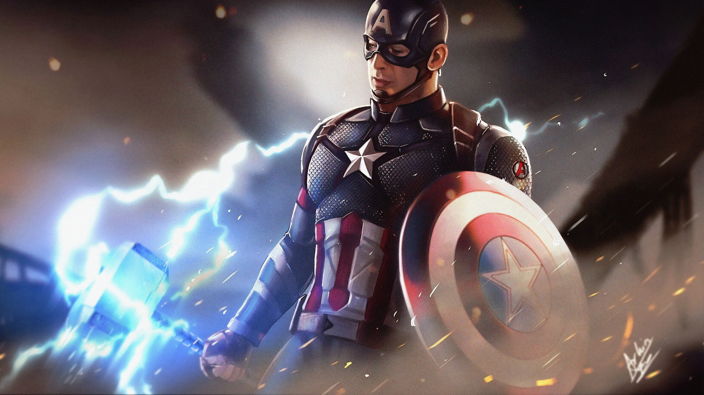


```Python Code Example 2 – Interactive Threshold with Trackbar:
import cv2
import numpy as np

img = cv2.imread(r"A:\computer_Vision\54.jpg")
img = cv2.resize(img, (250, 250))
img_gray = cv2.cvtColor(img, cv2.COLOR_BGR2GRAY)

def nothing(x):
    pass

cv2.namedWindow("Canny")
cv2.createTrackbar("Threshold", "Canny", 0, 255, nothing)

while True:
    a = cv2.getTrackbarPos("Threshold", "Canny")
    res = cv2.Canny(img_gray, a, 255)
    cv2.imshow("Canny", res)

    k = cv2.waitKey(1) & 0xFF
    if k == 27:  # ESC key
        break

cv2.destroyAllWindows()
```

# THE IMAGE WICH IS USED IN THE CODE:


# Important Notes:
***Adjust the thresholds to control sensitivity of edge detection.
Trackbars provide an interactive way to tune thresholds in real-time.
Always convert images to grayscale before applying Canny.***


# Code No 31-) Image Pyramids – OpenCV:


   ***Introduction:***

   

***Image pyramids are used when we need to work with the same image at different resolutions.***


# Common applications:


***Searching for faces or eyes in images.
Image blending at multiple resolutions.***


# Types of pyramids:


# No 1 -) ***Gaussian Pyramid – Smooth downsampling of images.***
# No 2 -) ***Laplacian Pyramid – Captures differences between levels of Gaussian pyramid.***


```Python Code Example – Gaussian Pyramid:


import cv2
import numpy as np

# Load image and resize
img = cv2.imread(r"A:\computer_Vision\HARD.JPG")
img = cv2.resize(img, (400, 400))

# Gaussian pyramid: Downsampling
pd1 = cv2.pyrDown(img)
pd2 = cv2.pyrDown(pd1)

# Gaussian pyramid: Upsampling
pu1 = cv2.pyrUp(pd2)
pu2 = cv2.pyrUp(pu1)

# Display all images
cv2.imshow("Original Image", img)
cv2.imshow("Pyramid Down 1", pd1)
cv2.imshow("Pyramid Down 2", pd2)
cv2.imshow("Pyramid Up 1", pu1)
cv2.imshow("Pyramid Up 2", pu2)

cv2.waitKey(0)
cv2.destroyAllWindows()
```

# THE IMAGE WHICH IS USED INTO THE CODE:


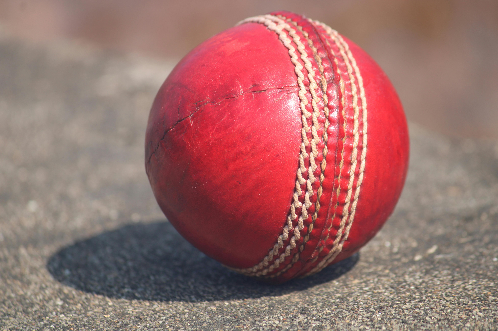


# Important Notes:


***pyrDown() reduces the resolution by half.
pyrUp() increases the resolution by doubling.
Pyramids are useful for multi-scale image analysis***


# Code No 32-) Object Detection on Live Video
   
   
   ***Theory***


***Object detection using color segmentation allows you to detect objects in a live video feed based on their color range.
We convert the video frame to HSV color space for better color detection.
Trackbars are used to adjust lower and upper HSV values in real-time.
cv2.inRange() creates a mask for the selected color.
cv2.bitwise_and() applies the mask to the frame to highlight detected objects.
Exit the program by pressing the 'n' key.***


``` Python Code:


import cv2
import numpy as np

# Start webcam capture
cap = cv2.VideoCapture(0)

# Trackbar callback function (does nothing)
def nothing(x):
    pass

# Create a window for color adjustment
cv2.namedWindow("Color Adjustment")

# Create HSV trackbars
cv2.createTrackbar("Lower_H", "Color Adjustment", 0, 255, nothing)
cv2.createTrackbar("Lower_S", "Color Adjustment", 0, 255, nothing)
cv2.createTrackbar("Lower_V", "Color Adjustment", 0, 255, nothing)
cv2.createTrackbar("Upper_H", "Color Adjustment", 255, 255, nothing)
cv2.createTrackbar("Upper_S", "Color Adjustment", 255, 255, nothing)
cv2.createTrackbar("Upper_V", "Color Adjustment", 255, 255, nothing)

while True:
    ret, frame = cap.read()
    if not ret:
        break

    frame = cv2.resize(frame, (500, 500))
    hsv = cv2.cvtColor(frame, cv2.COLOR_BGR2HSV)

    # Get trackbar positions for HSV bounds
    l_h = cv2.getTrackbarPos("Lower_H", "Color Adjustment")
    l_s = cv2.getTrackbarPos("Lower_S", "Color Adjustment")
    l_v = cv2.getTrackbarPos("Lower_V", "Color Adjustment")
    u_h = cv2.getTrackbarPos("Upper_H", "Color Adjustment")
    u_s = cv2.getTrackbarPos("Upper_S", "Color Adjustment")
    u_v = cv2.getTrackbarPos("Upper_V", "Color Adjustment")

    lower_bound = np.array([l_h, l_s, l_v])
    upper_bound = np.array([u_h, u_s, u_v])

    # Create mask and apply it
    mask = cv2.inRange(hsv, lower_bound, upper_bound)
    res = cv2.bitwise_and(frame, frame, mask=mask)

    # Show frames
    cv2.imshow("Original Frame", frame)
    cv2.imshow("Mask", mask)
    cv2.imshow("Result", res)

    # Exit on pressing 'n' key
    if cv2.waitKey(25) & 0xFF == 110:
        break

cap.release()
cv2.destroyAllWindows()
```


# Code No 33-) Object Detection OpenCV:


***Theory***


***Object Detection (Part 2)
Detect objects in an image based on HSV color ranges.
Trackbars allow real-time adjustment of lower and upper HSV values.
cv2.inRange() creates a mask for the selected color range.
cv2.bitwise_and() applies the mask to highlight the detected objects.***


# Object Detection Code:

```Python Code:
import cv2
import numpy as np

# Load image
frame = cv2.imread(r"A:\computer_Vision\collor_balls.jpg")
frame = cv2.resize(frame, (500, 500))

def nothing(x):
    pass

# Trackbar window
cv2.namedWindow("Color Adjustments")
cv2.createTrackbar("Lower_H", "Color Adjustments", 0, 255, nothing)
cv2.createTrackbar("Lower_S", "Color Adjustments", 0, 255, nothing)
cv2.createTrackbar("Lower_V", "Color Adjustments", 0, 255, nothing)
cv2.createTrackbar("Upper_H", "Color Adjustments", 255, 255, nothing)
cv2.createTrackbar("Upper_S", "Color Adjustments", 255, 255, nothing)
cv2.createTrackbar("Upper_V", "Color Adjustments", 255, 255, nothing)

while True:
    hsv = cv2.cvtColor(frame, cv2.COLOR_BGR2HSV)

    lower_bound = np.array([cv2.getTrackbarPos("Lower_H", "Color Adjustments"),
                            cv2.getTrackbarPos("Lower_S", "Color Adjustments"),
                            cv2.getTrackbarPos("Lower_V", "Color Adjustments")])
    upper_bound = np.array([cv2.getTrackbarPos("Upper_H", "Color Adjustments"),
                            cv2.getTrackbarPos("Upper_S", "Color Adjustments"),
                            cv2.getTrackbarPos("Upper_V", "Color Adjustments")])

    mask = cv2.inRange(hsv, lower_bound, upper_bound)
    res = cv2.bitwise_and(frame, frame, mask=mask)

    cv2.imshow("Original Frame", frame)
    cv2.imshow("Mask", mask)
    cv2.imshow("Result", res)

    if cv2.waitKey(1) & 0xFF == 27:  # ESC key to exit
        break
cv2.destroyAllWindows()
```

# THE IMAGE WHICH IS THE INTO THE CODE:


# Code No 34-) Object Tracking and Detection Using OpenCV
   
   
   ***Theory***

   
***Object Tracking can be done using MeanShift or HOG-based human detection.
#MeanShift Algorithm:
Select a target and calculate its histogram for backprojection.
Set an initial location of the window.
Define termination criteria to stop the tracking.
HOG Human Detection:
Uses Histogram of Oriented Gradients + SVM detector to detect humans in frames.
Detects humans and draws rectangles or rotated boxes around them.***


# Code – Method 1 (MeanShift + HOG + Frozen ROI)


# THIS CODE IS FOR VIDEOS:


```Python Code:


import cv2
import numpy as np

# Load video
cap = cv2.VideoCapture(r"A:\computer_Vision\2008.mp4")
if not cap.isOpened():
    print("Error: Video not found")
    exit()

# Initialize HOG human detector
hog = cv2.HOGDescriptor()
hog.setSVMDetector(cv2.HOGDescriptor_getDefaultPeopleDetector())

# Random ROI settings
width, height = 120, 180
roi_frozen = False
frozen_roi = None

# Select initial random ROI
ret, frame = cap.read()
if ret:
    frame = cv2.resize(frame, (500, 300))
    h, w, _ = frame.shape
    x = np.random.randint(0, w - width)
    y = np.random.randint(0, h - height)
    frozen_roi = frame[y:y + height, x:x + width]

while True:
    ret, frame = cap.read()
    if not ret:
        break

    frame = cv2.resize(frame, (500, 300))
    output_frame = frame.copy()

    # Detect humans
    boxes, weights = hog.detectMultiScale(frame, winStride=(8,8), padding=(16,16), scale=1.05)
    for (hx, hy, hw, hh) in boxes:
        cv2.rectangle(output_frame, (hx, hy), (hx + hw, hy + hh), (0, 255, 0), 2)
        cv2.putText(output_frame, "Person", (hx, hy-5), cv2.FONT_HERSHEY_SIMPLEX, 0.5, (0,255,0), 2)

    # Draw rectangle around frozen ROI
    cv2.rectangle(output_frame, (x, y), (x + width, y + height), (255, 0, 0), 2)

    # Show video and frozen ROI
    cv2.imshow("Video with Humans", output_frame)
    if frozen_roi is not None:
        cv2.imshow("Frozen ROI", frozen_roi)

    k = cv2.waitKey(30) & 0xff
    if k == 32:  # SPACE to freeze ROI permanently
        roi_frozen = True
    if k == 110:  # n to exit
        break

cap.release()
cv2.destroyAllWindows()
```


# Code – Method 2 (HOG Human Detection with Rotated Boxes):


```Python Code:


import cv2
import numpy as np

# Load video
cap = cv2.VideoCapture(r"A:\computer_Vision\2008.mp4")
if not cap.isOpened():
    print("Error: Video not found")
    exit()

# HOG Human Detector
hog = cv2.HOGDescriptor()
hog.setSVMDetector(cv2.HOGDescriptor_getDefaultPeopleDetector())

while True:
    ret, frame = cap.read()
    if not ret:
        break

    frame = cv2.resize(frame, (800, 450))
    all_pts = []

    # Detect humans
    boxes, weights = hog.detectMultiScale(frame, winStride=(8, 8), padding=(8, 8), scale=1.05)
    for (x, y, w, h) in boxes:
        # Convert to float for rotated rectangle
        cx, cy = float(x + w / 2), float(y + h / 2)
        rect = ((cx, cy), (float(w), float(h)), 0.0)
        box = cv2.boxPoints(rect)
        pts = np.int64(box)
        all_pts.append(pts)

    # Draw all rotated rectangles
    if len(all_pts) > 0:
        cv2.polylines(frame, all_pts, True, (255, 0, 0), 1)

    cv2.imshow("Human Detection frames:", frame)

    key = cv2.waitKey(1) & 0xFF
    if key == 27 or key == ord('n'):
        break

cap.release()
cv2.destroyAllWindows()
```


# This Markdown format is simple:

***Theory at the top
Two code blocks separated for Method 1 and Method 2
Comments inside the code explain each step clearly***


# THIS IS THE VIDEO WHICH IS USED IN THE CODE:


[Watch Video](images/2008.mp4)


# Code No 35-) ***Image Blending using Trackbars (OpenCV):***


   ***Introduction***


**Image blending is a technique used in image processing to combine two images into a single image. In this project, we use OpenCV trackbars to dynamically control the blending ratio between two images in real time.
This makes the blending process interactive and easy to understand.**

# ***How it Works***


***Two images are loaded and resized to the same size.
A window is created with trackbars.
The alpha trackbar controls the blending ratio.
A switch (ON/OFF) decides whether blending is applied or not.
The function cv2.addWeighted() is used for blending.***


# ***Key Concept***


***The blending formula used is:***

***Output = (1 - alpha) * Image1 + alpha * Image2
alpha = 0 → Only Image1
alpha = 1 → Only Image2
0 < alpha < 1 → Mixed Image***


# Project: Image Blending using Trackbars:


```Python Code:

import cv2
import numpy as np

def nothing(x):
    pass

# Read images
img1 = cv2.imread(r"A:\computer_Vision\pic_3.jpg")
img2 = cv2.imread(r"A:\computer_Vision\pic_4.jpg")

# Check images
if img1 is None or img2 is None:
    print("Error: Image not found")
    exit()

# Resize images to same size
img1 = cv2.resize(img1, (400, 400))
img2 = cv2.resize(img2, (400, 400))

# Create window
cv2.namedWindow("click")

# Create trackbars
cv2.createTrackbar("alpha", "click", 0, 100, nothing)
switch = "0 : OFF \n1 : ON"
cv2.createTrackbar(switch, "click", 0, 1, nothing)

while True:
    s = cv2.getTrackbarPos(switch, "click")
    a = cv2.getTrackbarPos("alpha", "click")
    n = a / 100.0

    if s == 0:
        output = img1.copy()
    else:
        output = cv2.addWeighted(img1, 1 - n, img2, n, 0)
        cv2.putText(output, str(a), (20, 50),
                    cv2.FONT_ITALIC, 2, (102, 0, 17), 2)

    cv2.imshow("click", output)

    if cv2.waitKey(1) & 0xFF == 27:
        break

cv2.destroyAllWindows()
```


# ***Features:***


***Real-time image blending
Adjustable transparency using trackbar
ON/OFF blending switch
Simple and interactive UI***


***Applications
Image editing tools
Computer vision projects
UI-based OpenCV application***


# THIS IS THE 1st IMAGE WHICH IS USED INTO THE CODE:


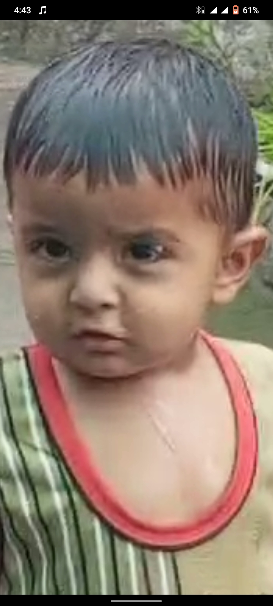


# THIS IS THE 2ND IMAGE WHICH IS THE INTO THE CODE:


# Code No 36-) Optical Flow using OpenCV:


  ***Theory***
  

***Optical Flow is the pattern of apparent motion of objects between two consecutive 
frames caused by movement of the object or camera.***


# Assumptions:
***Pixel intensities remain constant between consecutive frames
Neighboring pixels have similar motion.***


 
# Method 1: Lucas-Kanade Optical Flow.


***This method tracks sparse feature points (corners) across frames.***


```Python Code:


import cv2
import numpy as np

cap = cv2.VideoCapture("2008.mp4")

feature_params = dict(maxCorners=100, qualityLevel=0.3,
                      minDistance=7, blockSize=7)

lk_params = dict(winSize=(15, 15), maxLevel=2,
                 criteria=(cv2.TERM_CRITERIA_EPS |
                           cv2.TERM_CRITERIA_COUNT, 10, 0.03))

color = np.random.randint(0, 255, (100, 3))

ret, old_frame = cap.read()
old_frame = cv2.resize(old_frame, (500, 300))
old_gray = cv2.cvtColor(old_frame, cv2.COLOR_BGR2GRAY)

p0 = cv2.goodFeaturesToTrack(old_gray, mask=None, **feature_params)
mask = np.zeros_like(old_frame)

while True:
    ret, frame = cap.read()
    if not ret:
        break

    frame = cv2.resize(frame, (500, 300))
    frame_gray = cv2.cvtColor(frame, cv2.COLOR_BGR2GRAY)

    p1, st, err = cv2.calcOpticalFlowPyrLK(
        old_gray, frame_gray, p0, None, **lk_params)

    if p1 is not None:
        good_new = p1[st == 1]
        good_old = p0[st == 1]

        for i, (new, old) in enumerate(zip(good_new, good_old)):
            a, b = new.ravel()
            c, d = old.ravel()

            mask = cv2.line(mask, (int(a), int(b)),
                            (int(c), int(d)), color[i].tolist(), 2)
            frame = cv2.circle(frame, (int(a), int(b)),
                               3, color[i].tolist(), -1)

        img = cv2.add(frame, mask)
        cv2.imshow("Optical Flow (LK)", img)

        old_gray = frame_gray.copy()
        p0 = good_new.reshape(-1, 1, 2)

    if cv2.waitKey(30) & 0xFF == 27:
        break

cap.release()
cv2.destroyAllWindows()
```


# Method 2: Farneback Optical Flow:


***This method computes dense optical flow (motion for every pixel).***


```Python Code:


import cv2
import numpy as np

cap = cv2.VideoCapture("2008.mp4")

ret, frame1 = cap.read()
prvs = cv2.cvtColor(frame1, cv2.COLOR_BGR2GRAY)

hsv = np.zeros_like(frame1)
hsv[..., 1] = 255

while True:
    ret, frame2 = cap.read()
    if not ret:
        break

    next = cv2.cvtColor(frame2, cv2.COLOR_BGR2GRAY)

    flow = cv2.calcOpticalFlowFarneback(
        prvs, next, None, 0.5, 3, 15, 3, 5, 1.2, 0)

    mag, ang = cv2.cartToPolar(flow[..., 0], flow[..., 1])

    hsv[..., 0] = ang * 180 / np.pi / 2
    hsv[..., 2] = cv2.normalize(mag, None, 0, 255, cv2.NORM_MINMAX)

    rgb = cv2.cvtColor(hsv, cv2.COLOR_HSV2BGR)
    output = cv2.add(frame2, rgb)

    cv2.imshow("Optical Flow (Farneback)", output)

    if cv2.waitKey(60) & 0xFF == ord('n'):
        break

    prvs = next

cap.release()
cv2.destroyAllWindows()
```


# ***Comparison:***


***Method	Type	Speed	Accuracy
Lucas-Kanade	Sparse	Fast	Good for tracking points
Farneback	Dense	Slower	Captures f***


# THIS IS THE VIDEO WHICH IS USED INTO THE CDE:


[Watch Video](images/2008.mp4)


# Code No 37-) ROI (Region of Interest):
   
   
   ***Theory***
   

***ROI (Region of Interest) means selecting a specific part of an image for processing.
It allows focusing only on important areas
Reduces computation
Used in object detection, tracking, etc.***


***In OpenCV, ROI is selected using slicing:
img[y1:y2, x1:x2]***


```Python Code:


import cv2
import numpy as np

# Read image
img = cv2.imread("52.jpg")

# Check image loaded
if img is None:
    print("Error: Image not found")
    exit()

# Resize image
img = cv2.resize(img, (500, 500))

# Select ROI (Region of Interest)
roi = img[241:833, 2857:3321]

# Paste ROI to different locations
img[241:833, 2977:3441] = roi
img[241:833, 3097:3561] = roi
img[241:833, 2857:3321] = roi

# Show image
cv2.imshow("Image", img)

cv2.waitKey(0)
cv2.destroyAllWindows()
```


# Output
***Selected part of image is copied
Same region pasted at multiple location.***


# Code No 38-) Thresholding in OpenCV:
   
   
   ***Theory***
   

**Thresholding is used to convert a grayscale image into a binary image.
It separates pixels based on intensity
If pixel value > threshold → set to max value
If pixel value < threshold → set to 0**


# Useful for:

***Image segmentation
Object detection
Preprocessing***


# Types of Thresholding:


***THRESH_BINARY → pixel > thresh → white, else black
THRESH_BINARY_INV → opposite of binary
THRESH_TRUNC → values above threshold are truncated
THRESH_TOZERO → below threshold → 0
THRESH_TOZERO_INV → above threshold → 0***


```Python Code:


import cv2
import numpy as np

# Read image in grayscale
img = cv2.imread("602.jpg", cv2.IMREAD_GRAYSCALE)

cv2.imshow("Original", img)

# Apply different thresholding methods
_, th1 = cv2.threshold(img, 50, 255, cv2.THRESH_BINARY)
_, th2 = cv2.threshold(img, 50, 255, cv2.THRESH_BINARY_INV)
_, th3 = cv2.threshold(img, 127, 255, cv2.THRESH_TRUNC)
_, th4 = cv2.threshold(img, 127, 255, cv2.THRESH_TOZERO)
_, th5 = cv2.threshold(img, 127, 255, cv2.THRESH_TOZERO_INV)

# Show results
cv2.imshow("THRESH_BINARY", th1)
cv2.imshow("THRESH_BINARY_INV", th2)
cv2.imshow("THRESH_TRUNC", th3)
cv2.imshow("THRESH_TOZERO", th4)
cv2.imshow("THRESH_TOZERO_INV", th5)

cv2.waitKey(0)
cv2.destroyAllWindows()
```


# Output:


*Different thresholding techniques applied
Each method shows a different way of separating pixel intensities.*


# THIS IS THE CODE WHCH IS USED INTO THE CODE:


# Code No 39-) Template Matching (OpenCV)


   ***Theory***


***Template Matching is a technique used to find a small image (template) inside a larger image.
It slides the template over the image
Compares pixel values
Best match = highest similarity***


# Used in:


***Object detection
Pattern recognition***


***Method 1 (Face Detection)***


```Python Code:


import cv2
import numpy as np

img = cv2.imread("ben-ten.jpg")
gray = cv2.cvtColor(img, cv2.COLOR_BGR2GRAY)

face_cascade = cv2.CascadeClassifier(
    cv2.data.haarcascades + "haarcascade_frontalface_default.xml"
)

faces = face_cascade.detectMultiScale(gray, 1.1, 5)

for (x, y, w, h) in faces:
    cv2.rectangle(img, (x, y), (x+w, y+h), (0, 0, 255), 2)

cv2.imshow("Face Detection", img)
cv2.waitKey(0)
cv2.destroyAllWindows()
```


# THIS IS THE 1ST IMAGE WHICHC IS USED INTO THE CODE:


***Method 2 (Template Matching)***


```
Python Code:


import cv2
import numpy as np

img = cv2.imread("ben-ten.jpg")
img = cv2.resize(img, (250, 250))

gray = cv2.cvtColor(img, cv2.COLOR_BGR2GRAY)
_, thresh = cv2.threshold(gray, 120, 255, cv2.THRESH_BINARY)

template = thresh[50:120, 50:120]
h, w = template.shape

methods = [
    cv2.TM_CCOEFF,
    cv2.TM_CCOEFF_NORMED,
    cv2.TM_CCORR,
    cv2.TM_CCORR_NORMED,
    cv2.TM_SQDIFF,
    cv2.TM_SQDIFF_NORMED
]

for method in methods:
    img_draw = img.copy()

    res = cv2.matchTemplate(thresh, template, method)
    min_val, max_val, min_loc, max_loc = cv2.minMaxLoc(res)

    if method in [cv2.TM_SQDIFF, cv2.TM_SQDIFF_NORMED]:
        top_left = min_loc
    else:
        top_left = max_loc

    bottom_right = (top_left[0] + w, top_left[1] + h)
    cv2.rectangle(img_draw, top_left, bottom_right, (0, 255, 0), 2)

    cv2.imshow("Result", img_draw)
    cv2.waitKey(0)

cv2.destroyAllWindows()
```

***Output**


**Detects object location using template
Shows match using rectangle**


# THIS IS THE 2nd IMAGE WHICH IS USED IN TO THE CODE:


# Code No 40-) Video Background Removal:


# Theory:


***Background subtraction is a technique to isolate foreground objects in videos.
It works by separating moving objects (foreground) from a static or relatively static background.
There are multiple approaches to remove the background, and here we demonstrate 
two common methods: MOG2 and KNN.***


```Python Code:


import cv2
import numpy as np

# Loading Video (use raw string r"" for path)
cap = cv2.VideoCapture(r"A:\computer_Vision\2008.mp4")

# Background Subtraction Algorithms


# MOG2 algorithm (detect shadows)
algo1 = cv2.createBackgroundSubtractorMOG2(detectShadows=True)

# KNN algorithm (detect shadows)
algo2 = cv2.createBackgroundSubtractorKNN(detectShadows=True)

# Check if video opened successfully 
if not cap.isOpened():
    print("Error: Could not open video file.")
    exit()

#  Processing Video
while True:
    ret, frame = cap.read()
    if not ret:
        break

    # Resize frame for faster processing
    frame = cv2.resize(frame, (500, 300))

    # Apply background subtraction
    res1 = algo1.apply(frame)
    res2 = algo2.apply(frame)
    
    #  Display
    cv2.imshow("Video", frame)
    cv2.imshow("Result MOG2", res1)
    cv2.imshow("Result KNN", res2)

    # Press 'n' to exit
    if cv2.waitKey(25) & 0xFF == 110:  # ASCII of 'n'
        break

# Release resources
cap.release()
cv2.destroyAllWindows()
```

# THIS IS THE VIDEO WHICH IS USED INTO THE CODE:


[Watch Video](images/2008.mp4)


# Code Open 41-) Video Capture and Processing with OpenCV:


***Theory:***


***This code demonstrates three ways to capture and process video using OpenCV:***


***Method 1:*** 


**Local Webcam Capture – Captures video from your laptop webcam and displays both color and grayscale frames.**


***Method 2:***


**IP/Android Camera Streaming – Captures video from an Android device over the same Wi-Fi network and saves it locally.**


***Method 3:***


**YouTube Video Capture – Captures video frames from a YouTube link and saves them.
Each method also shows resizing frames and saving videos using OpenCV’s VideoWriter.**


#  Method 1: Local Webcam Capture:


```python Code


import cv2

cap = cv2.VideoCapture(0, cv2.CAP_DSHOW)

try:
    while True:
        ret, frame = cap.read()
        if not ret:
            break

        # Resize frame and convert to grayscale
        frame = cv2.resize(frame, (700, 600))
        gray = cv2.cvtColor(frame, cv2.COLOR_BGR2GRAY)

        # Display frames
        cv2.imshow("Color Frame", frame)
        cv2.imshow("Gray Frame", gray)

        # Press ESC to exit
        key = cv2.waitKey(1)
        if key == 27:
            break
except Exception as e:
    print("Error:", e)
finally:
    cap.release()
    cv2.destroyAllWindows()
```


# Method 2: IP/Android Camera Streaming:


```Python Code:


camera_url = "http://192.168.100.4:8080/video"
cap = cv2.VideoCapture()
cap.open(camera_url)
print("Camera opened:", cap.isOpened())

# Prepare video writer
fourcc = cv2.VideoWriter_fourcc(*"XVID")
output = cv2.VideoWriter("A:\\KING.mp4", fourcc, 20.0, (700, 600))

while cap.isOpened():
    ret, frame = cap.read()
    if ret:
        frame = cv2.resize(frame, (700, 600))
        output.write(frame)
        cv2.imshow("Color Frame", frame)

        # Press 'k' to exit
        if cv2.waitKey(1) & 0xFF == ord('k'):
            break
    else:
        break

cap.release()
output.release()
cv2.destroyAllWindows()
```

# Method 3: YouTube Video Capture:


```Python Code:


import pafy

youtube_url = "https://www.youtube.com/watch?v=DIf8twwgDzw"
video = pafy.new(youtube_url)
best = video.getbest(preftype="mp4")

cap = cv2.VideoCapture(best.url)
print("YouTube video opened:", cap.isOpened())

output = cv2.VideoWriter("A:\\KING.mp4", fourcc, 20.0, (700, 600))

while cap.isOpened():
    ret, frame = cap.read()
    if not ret:
        break

    frame = cv2.resize(frame, (700, 600))
    output.write(frame)
    cv2.imshow("Color Frame", frame)

    # Press 'k' to exit
    if cv2.waitKey(1) & 0xFF == ord('k'):
        break

cap.release()
output.release()
cv2.destroyAllWindows()
```


# This format is:

***Readable: Each method is clearly separated.
Documented: Small comments explain what each section does.
GitHub-ready: Perfect for a .py file with inline explanation***


